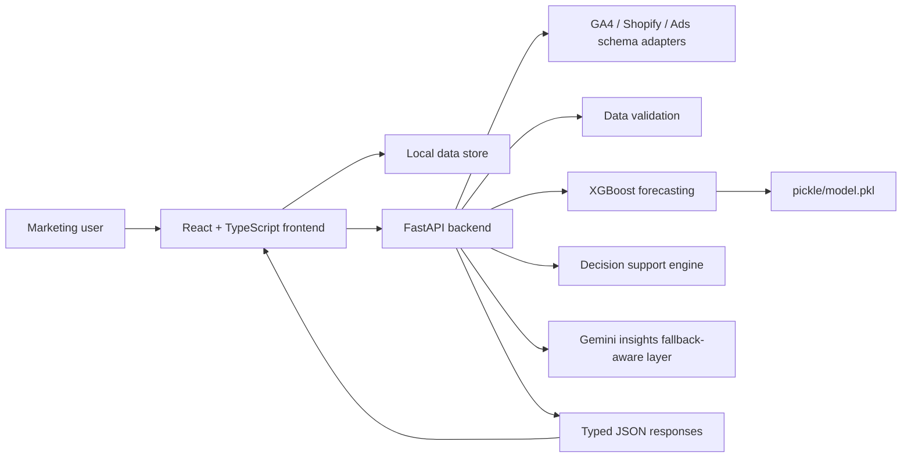
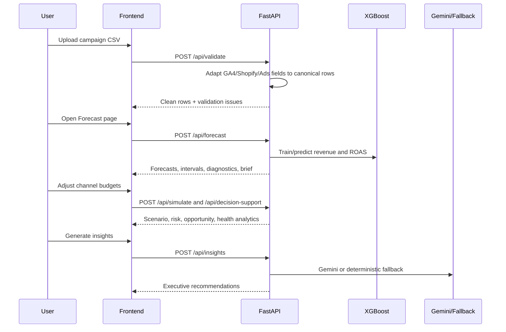

# ForecastIQ Architecture

## System Overview

ForecastIQ is a React and FastAPI application for ecommerce media forecasting. The frontend preserves the original Lovable-generated experience, while the backend adds validation, XGBoost forecasting, budget simulation, decision intelligence, and Gemini-backed executive insights.

## Frontend Responsibilities

- Preserve existing pages, layout, routes, and component styling.
- Parse CSV uploads and send normalized rows to backend APIs.
- Accept canonical campaign CSVs and common GA4, Shopify, and Ads export headers in the browser upload flow.
- Render dashboard, forecast, simulator, and insights workflows.
- Provide local fallback estimates when the backend is unavailable.
- Export a print-ready executive PDF report from generated insights.

## Backend Responsibilities

- Normalize GA4, Shopify, Ads, and canonical CSV schemas into the ForecastIQ campaign shape.
- Validate campaign records for missing values, invalid dates, duplicates, negative spend, and invalid revenue.
- Aggregate campaign data to daily modeling grain.
- Train revenue and ROAS XGBoost models with lag, rolling, seasonality, and media-volume features.
- Produce 30, 60, and 90 day forecasts with confidence intervals.
- Generate model diagnostics, feature importance, natural-language explanations, and executive forecast briefs.
- Simulate budget changes and run decision intelligence.
- Generate Gemini insights or deterministic fallback insights.

## API Surface

- `GET /health`
- `POST /api/validate`
- `POST /api/forecast`
- `POST /api/simulate`
- `POST /api/decision-support`
- `POST /api/insights`
- `POST /api/train`

## Data Flow

## Schema Adapter Layer

`backend/schema_adapters.py` is the compatibility boundary for evaluator and product data ingestion. It supports:

- GA4 fields such as `sessionSource`, `sessionMedium`, `purchaseRevenue`, `eventValue`, `sessions`, and `conversions`.
- Shopify fields such as `created_at`, `total_price`, `sales`, `orders`, and `product_type`.
- Ads fields such as `spend`, `cost`, `clicks`, `impressions`, `conversions`, `conversion_value`, and `revenue`.

Each CSV file is normalized before merging. This prevents mixed folders from losing revenue or date fields when one export uses `date` and another uses `created_at`.

## Model Design

The forecasting layer trains separate models for revenue and ROAS. Feature engineering includes media inputs, seasonality, trend, target lags, rolling target averages, and rolling spend. Confidence intervals are derived from residual volatility and widen over the forecast horizon.

The offline evaluator model uses a compact joblib sklearn artifact at `pickle/model.pkl`. If loading or feature generation fails, the deterministic safe baseline remains active and still produces the required prediction schema.

## Reliability Layers

ForecastIQ is designed to degrade gracefully instead of failing during a judge demo or automated evaluation:

- Evaluator isolation: `run.sh` only loads CSV data, loads `pickle/model.pkl` when compatible, writes `predictions.csv`, and exits.
- Trained model plus fallback: the packaged model is used for normal evaluator data, while `safe_baseline_fallback` covers corrupt models, unsupported schemas, tiny datasets, and malformed hidden files.
- Schema adapters: GA4, Shopify, Ads, and canonical CSV files are normalized before validation and modeling.
- Confidence intervals: residual calibration, horizon widening, and non-negative lower bounds keep forecast ranges business-safe.
- Gemini resilience: live Gemini output is optional; fallback executive insights use the same campaign summary when the API key, network, model, or response format fails.
- CI verification: the evaluator workflow compiles Python, runs tests, generates predictions, and checks schema, horizons, numeric output, and `trained_model` usage.

## Backtesting Snapshot

The latest holdout backtest trains on the earlier period and evaluates the final 30 days. The trained evaluator model improves MAE and RMSE versus the safe baseline on the primary 30-day holdout while preserving full interval coverage:

| Model         |      MAE |     RMSE |  MAPE | Interval coverage |
| ------------- | -------: | -------: | ----: | ----------------: |
| Trained model | 2,107.20 | 2,672.49 | 2.83% |           100.00% |
| Safe baseline | 2,185.89 | 2,763.76 | 2.78% |            88.89% |

This is why both modes coexist: the trained model improves credibility and normal-case quality, while the fallback protects hidden-dataset reliability.

## Deployment Model

Frontend and backend can deploy independently:

- Frontend: static Vite build using `VITE_API_BASE_URL`.
- Backend: Python service running FastAPI and Uvicorn.
- Model bundle: `pickle/model.pkl` packaged with the backend or generated through `backend.train`.
- Suggested hosting: Vercel for the frontend, Render or Railway for the backend.
- Required production safeguards: backend-only Gemini keys, configured CORS origins, packaged model artifact, and an offline evaluator smoke test before submission.

Recommended deployment commands:

- Vercel frontend: build with `pnpm run build` or `npm run build`, output `dist`, set `VITE_API_BASE_URL` to the hosted backend.
- Render/Railway backend: build with `pip install -r requirements.txt`, start with `python -m uvicorn backend.main:app --host 0.0.0.0 --port $PORT`.
- Environment: keep `GEMINI_API_KEY` backend-only and restrict `CORS_ORIGINS` to the production frontend URL.
