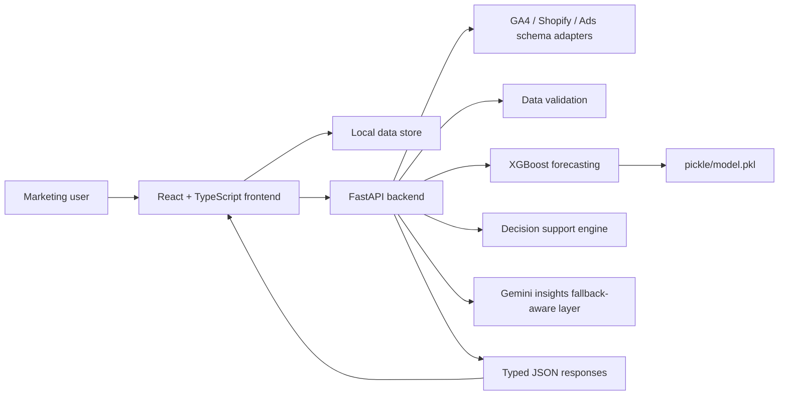
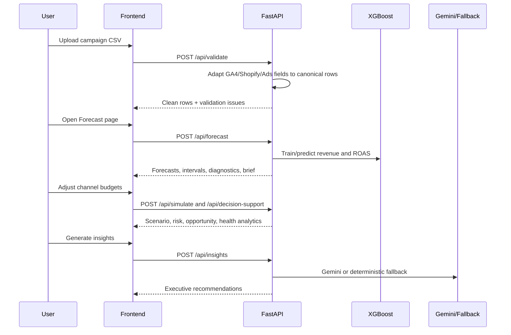

# ForecastIQ Architecture

## System Overview

ForecastIQ is a React and FastAPI application for ecommerce media forecasting. The frontend preserves the original Lovable-generated experience, while the backend adds validation, XGBoost forecasting, budget simulation, decision intelligence, and Gemini-backed executive insights.

## Frontend Responsibilities

- Preserve existing pages, layout, routes, and component styling.
- Parse CSV uploads and send normalized rows to backend APIs.
- Accept canonical campaign CSVs and common GA4, Shopify, and Ads export headers in the browser upload flow.
- Render dashboard, forecast, simulator, and insights workflows.
- Provide local fallback estimates when the backend is unavailable.
- Export a print-ready executive PDF report from generated insights.

## Backend Responsibilities

- Normalize GA4, Shopify, Ads, and canonical CSV schemas into the ForecastIQ campaign shape.
- Validate campaign records for missing values, invalid dates, duplicates, negative spend, and invalid revenue.
- Aggregate campaign data to daily modeling grain.
- Train revenue and ROAS XGBoost models with lag, rolling, seasonality, and media-volume features.
- Produce 30, 60, and 90 day forecasts with confidence intervals.
- Generate model diagnostics, feature importance, natural-language explanations, and executive forecast briefs.
- Simulate budget changes and run decision intelligence.
- Generate Gemini insights or deterministic fallback insights that produce causal hypotheses grounded in forecast, anomaly, trend-break, spend, revenue, and ROAS signals.

## API Surface

- `GET /health`
- `POST /api/validate`
- `POST /api/forecast`
- `POST /api/simulate`
- `POST /api/decision-support`
- `POST /api/insights`
- `POST /api/train`

## Data Flow

## Schema Adapter Layer

`backend/schema_adapters.py` is the compatibility boundary for evaluator and product data ingestion. It supports:

- GA4 fields such as `sessionSource`, `sessionMedium`, `purchaseRevenue`, `eventValue`, `sessions`, and `conversions`.
- Shopify fields such as `created_at`, `total_price`, `sales`, `orders`, and `product_type`.
- Ads fields such as `spend`, `cost`, `metrics_cost_micros`, `clicks`, `metrics_clicks`, `impressions`, `metrics_impressions`, `conversions`, `metrics_conversions`, `metrics_conversions_value`, `conversion`, `conversion_value`, and `revenue`.

Each CSV file is normalized with `source_schema` and `source_file` provenance before merging. Multi-source folders are reconciled instead of blindly concatenated: Shopify/order files are treated as revenue-of-record when present, GA4 revenue is used as the revenue source when Shopify is absent, and Ads files provide spend, delivery, and conversion shape. This prevents overlapping GA4, Shopify, and Ads exports from double-counting the same ecommerce revenue.

## Model Design

The forecasting layer trains separate models for revenue and ROAS. Feature engineering includes media inputs, seasonality, trend, target lags, rolling target averages, and rolling spend. Confidence intervals are derived from residual volatility and widen over the forecast horizon. Revenue intervals and ROAS intervals are emitted together in the offline evaluator output and live API summary. The revenue model contributes a weighted blend only when a chronological holdout gate validates it against the deterministic baseline; the exact dual-gated weight is stored per horizon in the artifact's confidence block. If spend is absent, ROAS is marked `not_computable` with numeric zero bounds so the evaluator contract remains NaN-safe without inventing a confident efficiency metric.

The live and offline forecasting paths intentionally optimize for different constraints. The live API uses XGBoost-first daily forecasts for interactive charts, explainability, and budget simulation. The offline evaluator uses a compact pre-trained sklearn artifact so `run.sh` stays fast, deterministic, and independent of servers or optional AI services. They share schema normalization, 30/60/90-day horizons, non-negative outputs, uncertainty guardrails, and safe fallback principles, but exact numerical parity is neither promised nor presented because the estimators and output grains differ.

The offline evaluator model uses a compact joblib sklearn artifact at `pickle/model.pkl`. The artifact stores dedicated training-sample counts by horizon plus horizon-aware revenue and ROAS blend weights. If a horizon has fewer than the minimum dedicated samples during training, that horizon is marked fallback-only instead of training on mismatched target scales. If loading or feature generation fails, the deterministic safe baseline remains active and still produces the required prediction schema.

## Blend Weight Decision Logic

The offline evaluator uses adaptive per-horizon blend weights determined by holdout gates applied during training.

**Revenue model weight** (gate: CV R2 threshold and chronological holdout):

| Gate | Condition | Revenue model weight |
| --- | --- | ---: |
| Strong evidence | CV R2 >= 0.15 and chronological holdout beats deterministic baseline | horizon-calibrated: 30d 0.60, 60d 0.10, 90d 0.50 |
| Moderate evidence | CV R2 >= 0.05 and chronological holdout beats deterministic baseline | horizon-calibrated: 30d 0.25, 60d 0.10, 90d 0.40 |
| Weak evidence | Chronological holdout beats deterministic baseline but CV R2 < 0.05 | horizon-calibrated: 30d 0.10, 60d 0.10, 90d 0.25 |
| No evidence | Chronological holdout does not beat deterministic baseline | 0.00 |

**ROAS model weight** (gate: chronological holdout only):

| Gate | Condition | ROAS model weight |
| --- | --- | ---: |
| Holdout validates | Trained ROAS MAE < naive mean MAE on chronological holdout slice | 0.60 |
| No holdout evidence | Trained ROAS model does not beat naive mean on holdout slice | 0.10 |

Both gates use the latest 20% of each horizon's dedicated training samples by target date to check whether the trained model beats a naive mean forecast. This prevents CV overfitting on small per-horizon samples.

If both revenue gates produce 0.00 for all horizons, the evaluator uses the deterministic safe baseline exclusively for revenue, which is correct behavior when the training data is too small for the ML path to generalize. ROAS uses a soft floor of 0.10 even when the holdout gate fails, preserving some ML-driven ROAS signal while limiting exposure on thin data.

The `/api/train` endpoint is deliberately separate from public forecasting. It requires `TRAINING_ADMIN_TOKEN`, rejects path traversal, and persists only evaluator-safe `.pkl` files under `pickle/`.

## Causal Insight Layer

ForecastIQ's AI layer performs causal-hypothesis generation, not formal causal inference. The frontend enriches the performance summary with anomaly and trend-break output before calling `/api/insights`. Gemini and the deterministic fallback are both instructed to explain likely mechanisms such as spend changes, conversion quality, ROAS trend, CPC or auction pressure, and channel concentration. The response language is intentionally framed as "likely because" or "consistent with" so judges can see the reasoning without mistaking it for a randomized incrementality study.

## Reliability Layers

ForecastIQ is designed to degrade gracefully instead of failing during a judge demo or automated evaluation:

- Evaluator isolation: `run.sh` only loads CSV data, loads `pickle/model.pkl` when compatible, writes `predictions.csv`, and exits.
- Trained model plus fallback: the packaged model is used for normal evaluator data, while `safe_baseline_fallback` covers corrupt models, unsupported schemas, tiny datasets, and malformed hidden files.
- Schema adapters: GA4, Shopify, Ads, and canonical CSV files are normalized and reconciled before validation and modeling.
- Real resource check: the public AIgnition Drive folder exposed Ads-shaped CSV headers for Google, Meta, and Bing; those observed columns are covered by regression tests.
- Confidence intervals: residual calibration, horizon widening, and non-negative lower bounds keep forecast ranges business-safe.
- Gemini resilience: live Gemini output is optional; fallback executive insights use the same campaign summary when the API key, network, model, or response format fails.
- CI verification: the evaluator workflow compiles Python, runs tests, generates predictions, and checks schema, horizons, numeric output, ROAS range ordering, and `trained_model` usage.

## Backtesting Snapshot

The latest holdout backtest trains on the earlier period and evaluates the final 30 days. It now reports revenue and ROAS metrics separately:

### Revenue

| Model         |      MAE |     RMSE |  MAPE | Interval coverage |
| ------------- | -------: | -------: | ----: | ----------------: |
| Trained model | 1,723.79 | 2,226.80 | 2.26% |           100.00% |
| Safe baseline | 2,185.89 | 2,763.76 | 2.78% |            88.89% |

### ROAS

| Model         |  MAE | RMSE |  MAPE | Interval coverage |
| ------------- | ---: | ---: | ----: | ----------------: |
| Trained model | 0.04 | 0.06 | 1.05% |           100.00% |
| Safe baseline | 0.05 | 0.07 | 1.44% |            88.89% |

Walk-forward validation also reports 30/60/90-day horizon behavior and records whether a fold used a trained horizon model or an explicit fallback-only horizon. This is why both modes coexist: the trained model adds validated ML behavior, while the fallback protects hidden-dataset stability.

| Horizon | Folds | Segments | Trained revenue MAE | Safe baseline MAE | Trained coverage | Revenue MAE winner |
| ------: | ----: | -------: | ------------------: | ----------------: | ---------------: | ------------------ |
|      30 |     3 |       54 |            2,462.00 |          3,097.88 |           92.59% | Trained model |
|      60 |     3 |       54 |           10,541.64 |         11,221.15 |           88.89% | Trained model |
|      90 |     3 |       54 |           20,891.06 |         31,577.72 |           90.74% | Trained model |

## Deployment Model

Frontend and backend can deploy independently:

- Frontend: static Vite build using `VITE_API_BASE_URL`.
- Backend: Python service running FastAPI and Uvicorn.
- Model bundle: `pickle/model.pkl` packaged with the backend or generated through `backend.train`.
- Suggested hosting: Vercel for the frontend, Render or Railway for the backend.
- Required production safeguards: backend-only Gemini keys, configured CORS origins, `TRAINING_ADMIN_TOKEN`, packaged model artifact, and an offline evaluator smoke test before submission.

Recommended deployment commands:

- Vercel frontend: build with `npm run build`, output `dist`, set `VITE_API_BASE_URL` to the hosted backend.
- Render/Railway backend: build with `pip install -r requirements-app.txt`, start with `python -m uvicorn backend.main:app --host 0.0.0.0 --port $PORT`.
- Environment: keep `GEMINI_API_KEY` backend-only and restrict `CORS_ORIGINS` to the production frontend URL.

The dependency boundary is intentional: `requirements.txt` is the minimal offline-evaluator stack, while `requirements-app.txt` adds FastAPI, XGBoost, Gemini, and test dependencies. The anomaly endpoint also computes channel spend-delta/revenue-delta associations. Those statistics are passed to the insight layer as hypothesis evidence, never as proof of causality or incrementality.
