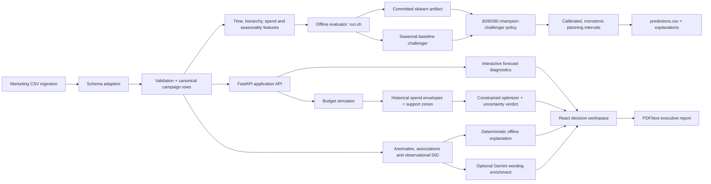

# ForecastIQ Architecture Overview

This file covers the standalone architecture deliverable for the NetElixir
AIgnition 3.0 submission: frontend stack, backend stack, forecasting pipeline,
and LLM integration workflow.

## System Flow

## Frontend Stack

- React + TypeScript + Vite for the product demo.
- Routes cover Upload, Dashboard, Forecast, Budget Simulator, AI Insights, and
  Executive Decision Center workflows.
- The frontend consumes FastAPI endpoints for validation, forecasts, simulator
  recommendations, spend curves, anomalies, and insights.

## Backend Stack

- FastAPI powers the interactive app API.
- The graded evaluator path is separate: `run.sh` calls `python -m
  backend.predict` and does not start frontend or backend servers.
- `requirements.txt` is sufficient for the graded path; `requirements-app.txt`
  adds API, Gemini, and frontend-test dependencies for local product demos.
- The spend-support calculation is shared by the pandas and memory-safe API
  paths, so zones and optimizer constraints serialize identically.

## Forecasting Pipeline

1. Marketing CSVs are loaded from the provided `data/` folder.
2. `backend/schema_adapters.py` normalizes GA4, Shopify, Google Ads, Meta Ads,
   Microsoft/Bing Ads, and common alias columns into canonical marketing fields.
3. `backend/segment_utils.py` and `backend/train.py` produce time, segment,
   rolling-window, ROAS, spend, and channel-mix features.
4. `backend/inference.py` loads `pickle/model.pkl`, applies the trained
   GradientBoostingRegressor residual correction where validated, and falls
   back safely for unusable inputs.
5. `backend/evaluator_intervals.py` and the final writer calibrate and audit
   revenue/ROAS intervals before `predictions.csv` is written.

## LLM Integration Workflow

- Offline evaluator: `backend/anomaly.py`, `backend/causal_lite.py`,
  `backend/gemini_offline_cache.py`, and `backend/evaluator_io.py` compute
  structured causal evidence and synthesize `causal_summary.txt` without any
  network call.
- Optional enrichment: when `GEMINI_API_KEY` is configured, bounded Gemini
  wording can enrich the evidence. Valid results never require this path.
- Product API: `backend/gemini.py` and `backend/main.py` provide Gemini-powered
  AI insights for the interactive FastAPI + React experience, with deterministic
  fallback behavior when Gemini is unavailable.
