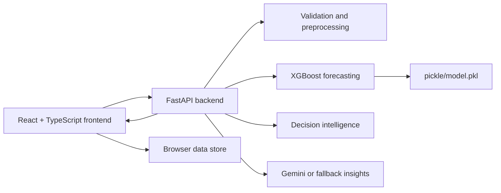
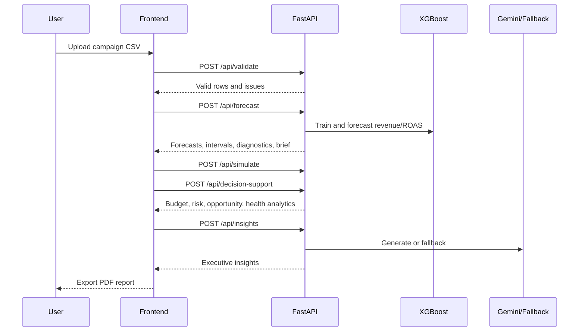

# AIgnition ForecastIQ

[](https://github.com/VINAY-KUMAR-PY/ignite-forecast-iq/actions/workflows/evaluator-ci.yml)

AIgnition ForecastIQ is an AI-powered ecommerce forecasting platform built for NetElixir AIgnition 3.0. It preserves the original Lovable React experience and adds a production-style FastAPI backend for data validation, XGBoost revenue and ROAS forecasting, budget simulation, model persistence, and Gemini-assisted executive insights.

> **Deployment:** Backend → [Render](https://render.com) using `render.yaml`.
> Frontend → [Vercel](https://vercel.com) using `vercel.json`.
> Set `VITE_API_BASE_URL` in Vercel to your Render backend URL.
> Set `GEMINI_API_KEY` and comma-separated `CORS_ORIGINS` as Render environment secrets.
> One-click deploy path is fully configured. See `ARCHITECTURE.md` for self-hosting instructions.

## Evaluator Reliability Snapshot

The offline evaluator path is intentionally isolated from the web app. `run.sh` reads CSV files, loads the packaged model when compatible, writes `predictions.csv`, and exits without starting frontend/backend servers or calling Gemini.

| Item                                 | Value                                                                                      |
| ------------------------------------ | ------------------------------------------------------------------------------------------ |
| Trained-artifact runtime             | Python 3.11-3.14; artifact built and fully verified on 3.14.4                              |
| Compatibility runtime                | Python 3.10, verified through the deterministic safe baseline                              |
| scikit-learn version                 | 1.9.0                                                                                      |
| Model artifact                       | `pickle/model.pkl`                                                                         |
| Model artifact size                  | ~884 KB                                                                                    |
| Model artifact version               | 4                                                                                          |
| Training rows                        | 1,440                                                                                      |
| Rolling training samples             | 414                                                                                        |
| Feature count                        | 35 evaluator features plus live holiday/seasonality flags                                  |
| Normal evaluator mode                | `trained_model`                                                                            |
| Safe fallback mode                   | `safe_baseline_fallback` for missing/corrupt/incompatible model or unsupported hidden data |

## 30-Second Product Summary

ForecastIQ helps ecommerce marketing teams decide where the next budget dollar should go. A judge can click **Try Live Demo** from the homepage and land directly in a populated Decision Center, or upload campaign history manually. The product then shows 30/60/90-day revenue and ROAS forecasts, budget scenarios, and a plain-language executive brief. The offline evaluator path remains fast and deterministic, while the live app gives judges a polished planning experience for Google Ads, Meta Ads, and Microsoft Ads investments.

## Problem Statement

Ecommerce marketing teams need to understand how paid media spend across Google Ads, Meta Ads, and Microsoft Ads will affect revenue and ROAS over the next 30, 60, and 90 days. Static dashboards show what happened, but they do not reliably answer planning questions such as:

- Which channel should receive incremental budget?
- What revenue range should leadership expect?
- Which campaigns are creating or destroying efficiency?
- What risks should be addressed before reallocating spend?

ForecastIQ turns historical campaign data into forward-looking forecasts, confidence intervals, and business recommendations.

## Business Context

Digital marketing decisions are made under uncertainty. A useful planning product must connect predictive modeling with practical media operations: validation of uploaded data, explainable forecasts, scenario planning, and executive-level recommendations. This project focuses on the workflows a growth, analytics, or performance marketing team would use before weekly or monthly budget decisions.

## Solution Overview

The application contains four core flows:

- Dashboard: campaign performance overview and analytics charts.
- CSV Upload: client-side parsing plus backend validation for missing values, invalid dates, duplicate records, negative spend, and invalid revenue.
- Forecast: backend-powered 30, 60, and 90-day forecasts for overall, channel, campaign type, and campaign-level planning.
- Budget Simulator: dynamic revenue and ROAS projections when Google Ads, Meta Ads, or Microsoft Ads budgets change.
- Decision Intelligence: AI budget optimization, what-if scenario comparison, risk and opportunity detection, and channel health scoring.
- AI Insights: Gemini-generated, or deterministic fallback, causal-hypothesis executive summaries, risks, opportunities, revenue drivers, budget recommendations, and action plans.

The frontend keeps the existing pages, routes, components, and styling. Backend APIs replace the mock forecast and insight paths while frontend fallbacks remain available for local resilience.

## For Judges

Use this path for the fastest evaluation:

1. Start at `/` and click **Try Live Demo**. ForecastIQ loads sample multi-channel campaign data automatically and opens the app.
2. Review `/app` for the Executive Decision Center: recommended budget action, expected impact, confidence, and risk.
3. Open `/app/upload` only if you want to inspect validation or upload your own GA4, Shopify, or Ads CSV.
4. Open `/app/forecast` to review 30/60/90-day forecasts, confidence intervals, model accuracy, and feature-driver explanations.
5. Open `/app/simulator` to test budget increases/decreases and review channel recommendations.
6. Open `/app/insights`, generate the executive brief, and export the report.
7. Optionally verify the offline evaluator with `./run.sh ./data ./pickle/model.pkl ./output/predictions.csv`.

Judge-demo checklist:

| Check | Where to verify |
| --- | --- |
| One-click demo | Homepage **Try Live Demo** button |
| Upload CSV | `/app/upload`, sample CSV or custom GA4/Shopify/Ads export |
| Forecast generation | `/app/forecast`, 30/60/90-day forecast selector |
| Why this forecast? | `/app/forecast`, local explainability panel |
| Budget simulator | `/app/simulator`, quick scenarios and recommended allocation |
| AI insights | `/app/insights`, Gemini or deterministic fallback brief |
| Export/report | `/app/insights`, Export PDF |
| Offline evaluator | `./run.sh ./data ./pickle/model.pkl ./output/predictions.csv` |
| Health check | `GET /health` |
| Deployment instructions | Live Demo Deployment section below |

## Dashboard Features

- Executive summary cards for forecasted revenue, expected ROAS, best channel, weakest channel, and confidence score.
- Executive Decision Center with recommended budget action, expected revenue impact, ROAS impact, risk level, and top next actions.
- Risk and opportunity alerts written in business language.
- Revenue, spend, ROAS, channel contribution, and campaign performance charts.
- Empty, loading, and fallback states so the demo remains usable even when backend AI services are unavailable.

## Feature Highlights

- Production-style FastAPI backend with CORS and typed API contracts.
- CSV validation for missing values, invalid dates, duplicates, negative spend, and invalid revenue.
- XGBoost revenue and ROAS forecasting for 30, 60, and 90 day horizons.
- Horizon-specific evaluator sub-models for 30, 60, and 90 day revenue targets.
- Holiday and seasonality feature flags for Q4, major US retail weeks, cyclical month/week signals, and Black Friday proximity.
- Anomaly detection for revenue, spend, ROAS, CTR, and structural trend breaks.
- Forecast Accuracy Dashboard with MAE, RMSE, MAPE, and R2.
- Forecast Explainability Center with XGBoost feature importance and natural-language driver explanations.
- Confidence interval visualization and planning-case summaries.
- Budget Simulator for Google Ads, Meta Ads, and Microsoft Ads with spend response curves and diminishing-returns markers.
- Decision intelligence: AI budget optimizer, what-if scenarios, risk detection, opportunity detection, and channel health scoring.
- Gemini-backed AI insights with deterministic fallback output and anomaly-aware causal-hypothesis framing.
- Executive PDF report export from the AI Insights workflow, with a jsPDF path when dependencies are installed and a browser-safe fallback.

## Business Impact

ForecastIQ is designed for weekly and monthly marketing planning. It helps teams:

- Quantify revenue and ROAS expectations before budgets are committed.
- Compare conservative, expected, and upside planning cases.
- Identify budget inefficiency and over-spending risk.
- Find high-growth or underinvested channels.
- Convert technical forecast output into executive-ready actions.
- Export a PDF-ready business report for leadership review.

## GA4, Shopify, and Ads Compatibility

ForecastIQ accepts canonical campaign CSVs and common ecommerce exports. The schema adapter layer auto-detects source columns, normalizes each CSV before merging, and produces the required modeling shape:

`date, channel, campaign_type, campaign_name, spend, clicks, impressions, conversions, revenue, roas`

Supported examples:

| Source        | Supported fields                                                                                   | Normalization behavior                                                                                           |
| ------------- | -------------------------------------------------------------------------------------------------- | ---------------------------------------------------------------------------------------------------------------- |
| GA4           | `sessionSource`, `sessionMedium`, `purchaseRevenue`, `eventValue`, `sessions`, `conversions`       | Maps source/medium to channel and campaign context, uses sessions as traffic volume, defaults missing spend to 0 |
| Shopify       | `created_at`, `total_price`, `sales`, `orders`, `product_type`                                     | Maps order revenue and product type into ecommerce campaign rows, defaults missing media spend to 0              |
| Ads platforms | `spend`, `cost`, `metrics_cost_micros`, `clicks`, `metrics_clicks`, `impressions`, `metrics_impressions`, `conversions`, `metrics_conversions`, `conversion_value`, `metrics_conversions_value`, `conversion`, `revenue`, `campaign`, `campaign_name` | Maps platform exports into paid media rows, converts Google Ads micros to currency units, and calculates ROAS when absent |

Multiple CSV files can be placed in the same `data/` folder. Each file is normalized with source provenance, then reconciled before modeling. If Shopify/order data is present, it is treated as revenue-of-record; GA4 and Ads rows are used for attribution, spend, clicks, impressions, and conversion shape instead of adding duplicate revenue. If GA4 and Ads are present without Shopify, GA4 revenue is treated as the revenue source and Ads rows provide media cost and delivery signals.

The public AIgnition Drive resource was inspected for visible file metadata and headers. It currently exposes Ads-shaped files named `google_ads_campaign_stats.csv`, `meta_ads_campaign_stats.csv`, and `bing_campaign_stats.csv`; the adapter supports their observed columns including `segments_date`, `metrics_cost_micros`, `metrics_conversions_value`, `date_start`, `conversion`, `TimePeriod`, `CampaignType`, and `CampaignName`.

## Why This Solution Stands Out

- It is evaluator-safe: `run.sh` produces predictions offline without starting servers or using external APIs.
- It is product-ready: the React app turns forecasts into decisions, not just charts.
- It is business-aware: every technical output is tied to a marketing action, budget move, risk, or opportunity.
- It is resilient: Gemini insights are supported, but deterministic fallback insights keep demos reliable.
- It is explainable: forecast metrics, confidence intervals, feature importance, and executive summaries are all visible to the user.

## Architecture



```text
React + TypeScript frontend
  |
  | HTTP JSON
  v
FastAPI backend
  |
  +-- schema_adapters.py: GA4, Shopify, Ads, and canonical CSV normalization
  +-- data_preprocessing.py: validation, aggregation, feature engineering
  +-- forecasting.py: XGBoost training, prediction, intervals, simulation
  +-- decision_support.py: budget optimizer, what-if, risks, opportunities, health scores
  +-- gemini.py: Gemini insights with deterministic fallback
  +-- train.py / predict.py: offline model and submission workflows
  |
  v
pickle/model.pkl
```

Key design choices:

- FastAPI provides typed request and response contracts through Pydantic.
- The backend accepts normalized campaign rows from the frontend and CSV-driven CLI workflows.
- `pickle/model.pkl` stores a model bundle containing revenue and ROAS estimators.
- The offline `run.sh` path does not require Gemini or internet access.
- CORS defaults support Vite development on ports 5173 and 3000.

## Data Flow Diagram



## Forecasting Methodology

ForecastIQ aggregates validated campaign rows to the requested planning grain and trains supervised time-series regressors. The primary estimator is XGBoost; if XGBoost is unavailable, the code can fall back to a scikit-learn gradient boosting regressor.

Feature engineering includes:

- Spend, clicks, impressions, and conversions.
- Day of week, month, trend, and yearly seasonality.
- Revenue or ROAS lag features at 1, 7, and 14 days.
- Rolling target and spend averages at 7 and 28 days.
- Recursive future features for multi-day forecasting.

Forecast outputs include:

- Historical points for chart continuity.
- Future predicted values.
- Lower and upper confidence bounds derived from residual volatility.
- Forecast accuracy metrics: MAE, RMSE, MAPE, and R2 score for revenue and ROAS.
- Model diagnostics: interval coverage, training days, XGBoost feature importance, and top feature drivers.
- Natural-language explainability for revenue and ROAS drivers.
- Channel-level spend/revenue delta correlations that ground causal hypotheses while explicitly avoiding incrementality claims.
- Executive business brief with summary, risks, opportunities, and recommended actions.

Confidence intervals are residual-based and widen over the forecast horizon. They are shown both as chart bands and as planning-case summaries so users can distinguish conservative, expected, and upside outcomes.

Supported horizons are 30, 60, and 90 days. Supported levels are overall, channel, campaign type, and campaign.

## Evaluator Model Validation

The offline evaluator artifact at `pickle/model.pkl` is a compact joblib artifact trained with the pinned environment below:

| Item                 | Value                        |
| -------------------- | ---------------------------- |
| Python               | 3.14.4                       |
| scikit-learn         | 1.9.0                        |
| scipy                | 1.17.1                       |
| pandas               | 3.0.3                        |
| numpy                | 2.4.6                        |
| joblib               | 1.5.3                        |
| Artifact type        | `forecastiq_evaluator_model` |
| Artifact version     | 4                            |
| Evaluator model type | `trained_model`              |
| Artifact size        | ~880 KB                      |
| Training rows        | 1,440                        |
| Rolling samples      | 414                          |
| Feature count        | 35                           |
| Revenue blend weight | adaptive per-horizon: 30d 0.00, 60d 0.00, 90d 0.00 |
| ROAS blend weight    | 0.40                         |
| Causal summary output | `output/causal_summary.txt` |

The evaluator model trains on rolling historical samples from `data/sample_campaigns.csv` and predicts 30, 60, and 90 day revenue and ROAS at overall, channel, campaign type, and campaign levels. The artifact stores dedicated training-sample counts by horizon: 252 samples for 30 days, 108 for 60 days, and 54 for 90 days. If a future training slice lacks enough dedicated samples for a horizon, that horizon is explicitly marked fallback-only instead of fitting on mismatched 30/60-day targets. The safe baseline remains available for missing, corrupt, incompatible, tiny, or malformed hidden evaluator data.

The offline predictions file includes revenue and ROAS ranges. `expected_roas`, `lower_roas`, and `upper_roas` are derived from the same projected-spend denominator used for revenue planning. When GA4 or Shopify-style exports do not contain spend, ForecastIQ keeps the CSV numeric and NaN-safe by emitting `expected_roas = lower_roas = upper_roas = 0` with `forecast_confidence = not_computable` instead of fabricating a confident ROAS from unrelated spend-bearing training data.

Backtesting uses the final 30 days as a holdout and trains on the earlier period. Current primary holdout metrics are:

### Revenue

| Model         |      MAE |     RMSE |  MAPE | Interval coverage |
| ------------- | -------: | -------: | ----: | ----------------: |
| Trained model | 2,185.89 | 2,763.76 | 2.78% |           100.00% |
| Safe baseline | 2,185.89 | 2,763.76 | 2.78% |           100.00% |

### ROAS

| Model         |  MAE | RMSE |  MAPE | Interval coverage |
| ------------- | ---: | ---: | ----: | ----------------: |
| Trained model | 0.05 | 0.06 | 1.26% |           100.00% |
| Safe baseline | 0.05 | 0.07 | 1.44% |           100.00% |

The evaluator uses holdout-gated revenue blend weights. On the primary 30-day sample holdout, the revenue model weight is 0.00 because the deterministic baseline has the best revenue RMSE/MAE balance; the trained path still contributes ROAS behavior, residual calibration, and diagnostics. This is reported honestly rather than presented as artificial lift. The summary is generated by:

```bash
python -m backend.backtest
```

Reports are written to `reports/backtest_report.json` and `reports/backtest_summary.md`.

## Model Performance Evidence

ForecastIQ keeps a trained model and a safe baseline because different hidden datasets can favor different behavior. The trained model provides ML-driven ROAS and interval behavior; the baseline protects point-forecast stability when data is tiny, malformed, or outside the training shape.

Current primary 30-day holdout evidence:

| Target | Trained MAE | Safe baseline MAE | MAE difference | Winner |
| --- | ---: | ---: | ---: | --- |
| Revenue | 2,185.89 | 2,185.89 | 0.00% | Tie |
| ROAS | 0.05 | 0.05 | Tie on rounded MAE | Tie |

Plain-English interpretation: revenue point estimates remain guarded by the deterministic baseline because the sample holdout shows baseline revenue RMSE/MAE is the strongest choice. The trained artifact still contributes ROAS behavior, uncertainty calibration, and explainability metadata. ForecastIQ therefore does not overclaim trained-model dominance.

Forecast explainability now includes two layers:

- Global feature importance and SHAP importance: which features mattered most across model training for the selected segment.
- Local "Why this forecast?" explainability: permutation-baseline driver cards showing which current forecast-row features pushed this specific forecast up or down versus typical historical values.

Blend-weight validation tested revenue model weights of 0.00, 0.10, 0.25, 0.40, 0.50, and 0.60. The packaged artifact now uses a holdout-gated 0.00 revenue blend because that weight produced the best revenue RMSE/MAE balance on the sample holdout. ROAS uses 0.40 because that weight produced the best ROAS RMSE/MAE balance.

| Revenue model weight |      MAE |     RMSE |  MAPE | Interval coverage |
| -------------------: | -------: | -------: | ----: | ----------------: |
|                 0.00 | 2,185.89 | 2,763.76 | 2.78% |           100.00% |
|                 0.10 | 2,255.94 | 2,778.33 | 2.82% |           100.00% |
|                 0.25 | 2,473.99 | 2,971.53 | 3.06% |           100.00% |
|                 0.40 | 2,772.59 | 3,335.93 | 3.50% |           100.00% |
|                 0.50 | 3,066.01 | 3,649.73 | 3.97% |           100.00% |
|                 0.60 | 3,359.44 | 4,005.06 | 4.43% |           100.00% |

| ROAS model weight |  MAE | RMSE |  MAPE | Interval coverage |
| ----------------: | ---: | ---: | ----: | ----------------: |
|              0.00 | 0.05 | 0.07 | 1.44% |           100.00% |
|              0.10 | 0.05 | 0.06 | 1.41% |           100.00% |
|              0.25 | 0.05 | 0.06 | 1.30% |           100.00% |
|              0.40 | 0.05 | 0.06 | 1.26% |           100.00% |
|              0.50 | 0.05 | 0.06 | 1.27% |           100.00% |
|              0.60 | 0.05 | 0.07 | 1.19% |           100.00% |

Walk-forward per-horizon backtesting is included for transparency:

| Horizon | Folds | Segments | Trained revenue MAE | Baseline revenue MAE | Trained ROAS MAE | Trained coverage | Revenue MAE winner |
| ------: | ----: | -------: | ------------------: | -------------------: | ---------------: | ---------------: | ------------------ |
|      30 |     3 |       54 |            3,154.41 |             3,097.88 |             0.05 |          100.00% | Safe baseline |
|      60 |     3 |       54 |           11,221.15 |            11,221.15 |             0.10 |          100.00% | Tie |
|      90 |     2 |       36 |           22,981.64 |            22,981.64 |             0.11 |          100.00% | Tie |

This is why ForecastIQ keeps both systems: the trained model provides ML behavior and calibrated uncertainty where validated, while the deterministic baseline remains a reliability guardrail for longer, thinner, or incompatible cases.

## Budget Simulator

The simulator accepts planned budget totals by channel and reprojects future daily media activity. For each channel it returns:

- Baseline daily and total spend.
- New daily and total spend.
- Baseline revenue.
- Projected revenue with lower and upper bounds.
- Baseline and projected ROAS.
- Daily forecast points for charting.

The simulator is dynamic: changing budgets in the UI triggers a backend forecast call and recalculates projected revenue, ROAS, and expected lift.

The simulator also includes a decision intelligence layer:

- AI budget optimizer with target revenue and target ROAS inputs.
- Recommended Google Ads, Meta Ads, and Microsoft Ads budgets.
- What-if scenario comparisons for revenue, ROAS, and profit impact.
- Risk detection for revenue decline, ROAS decline, budget inefficiency, and overspending.
- Opportunity detection for high-growth and underinvested channels.
- Channel health scores out of 100 with score drivers.

## AI Insights

The `/api/insights` endpoint converts performance summaries into structured executive guidance:

- Executive summary.
- Revenue drivers.
- Channel performance.
- Top and bottom campaign observations.
- Budget allocation recommendations.
- Risks and mitigations.
- Growth opportunities.
- Prioritized action plan with owners, timelines, and KPIs.

When `GEMINI_API_KEY` is configured, Gemini generates the structured response. Without a key, the backend returns deterministic data-grounded insights so the application remains demo-ready and offline-safe. Both paths frame recommendations as causal hypotheses grounded in metrics such as spend trend, revenue trend, ROAS trend, channel ROAS, anomalies, and trend breaks. This is not a formal media-mix or incrementality model; it is an executive reasoning layer that explains plausible mechanisms to test.

## Technology Stack

- Frontend: React 19, TypeScript, Vite, TanStack Router, Recharts, Tailwind CSS, Radix UI, shadcn-style components.
- Backend: Python, FastAPI, Pydantic, Uvicorn.
- Machine learning: XGBoost, scikit-learn, pandas, NumPy, joblib.
- AI insights: Google Gemini via the Google Gen AI SDK, with legacy SDK compatibility.
- Tooling: ESLint, Prettier, TypeScript, shell-based offline runner.

## Installation Guide

Prerequisites:

- Node.js 20+.
- pnpm, npm, or bun. The repository includes `bun.lock`, but Vite scripts also work through npm-compatible package managers.
- Python 3.11-3.14 for trained-artifact evaluation; Python 3.14 is the build environment for the committed artifact. Python 3.10 is CI-tested through the safe baseline because sklearn pickle compatibility is not promised across library generations.

Install frontend dependencies:

```bash
pnpm install
```

Install backend dependencies:

```bash
python -m venv .venv
source .venv/bin/activate
pip install -r requirements-app.txt
```

Windows PowerShell:

```powershell
python -m venv .venv
.\.venv\Scripts\Activate.ps1
pip install -r requirements-app.txt
```

Copy environment defaults if needed:

```bash
cp .env.example .env
```

## Usage Guide

### Automated Evaluation Command

For NetElixir AIgnition automated evaluation, use the offline runner only:

```bash
pip install -r requirements.txt
chmod +x run.sh
./run.sh ./data ./pickle/model.pkl ./output/predictions.csv
```

The runner:

- reads every `.csv` file from the provided data directory;
- creates the output directory automatically;
- writes `predictions.csv` at the requested output path;
- does not start the frontend, backend, Vite, FastAPI, or any long-running server;
- uses a lightweight joblib-trained sklearn artifact when compatible, with a deterministic evaluator-safe baseline as fallback.

`requirements.txt` intentionally contains only the exact, evaluator-critical scientific dependencies. The live FastAPI/Gemini/test stack is isolated in `requirements-app.txt`, reducing install time and failure surface during automated scoring. CI runs the evaluator contract on Python 3.10, 3.11, 3.12, 3.13, and 3.14; trained-model output is required on 3.11-3.14 and the compatibility fallback is accepted on 3.10.

Expected output columns:

| Column             | Meaning                                                                                 |
| ------------------ | --------------------------------------------------------------------------------------- |
| `level`            | Forecast grain: `overall`, `channel`, `campaign_type`, or `campaign`                    |
| `segment`          | Segment name, or `all` for the overall forecast                                         |
| `horizon_days`     | Forecast horizon: `30`, `60`, or `90`                                                   |
| `expected_revenue` | Point estimate for revenue                                                              |
| `lower_revenue`    | Conservative revenue interval bound                                                     |
| `upper_revenue`    | Upside revenue interval bound                                                           |
| `expected_roas`    | Expected revenue divided by projected spend                                             |
| `lower_roas`       | Conservative ROAS interval bound, or `0` when spend is not computable                   |
| `upper_roas`       | Upside ROAS interval bound, or `0` when spend is not computable                         |
| `model_type`       | `trained_model` for compatible artifact predictions, otherwise `safe_baseline_fallback` |
| `interval_width_pct` | Revenue interval width as a percentage of expected revenue                            |
| `forecast_confidence` | `high`, `medium`, `low`, or `not_computable` for zero-spend ROAS cases              |

Assumptions and fallback behavior:

- Hidden evaluator data may use common marketing aliases such as `cost`, `sales`, `source`, `platform`, or `campaign`; these are normalized automatically.
- GA4, Shopify, and Ads exports are auto-detected and normalized per file before merging.
- Optional columns such as clicks, impressions, conversions, campaign type, campaign name, and ROAS are filled safely when absent.
- Rows with negative spend or negative revenue are removed; malformed dates are logged and repaired when possible.
- If the model artifact is missing, corrupt, incompatible, or the hidden dataset is too small for model features, the runner uses `safe_baseline_fallback` instead of retraining.
- The output file is always non-empty and numeric fields are cleaned to avoid `NaN` or infinite values.

Start the backend:

```bash
python -m uvicorn backend.main:app --reload --host 127.0.0.1 --port 8000
```

Or use the package script:

```bash
pnpm run api
```

Start the frontend:

```bash
pnpm run dev
```

Open the Vite URL and use the existing app routes:

- `/app` for the dashboard.
- `/app/upload` for CSV upload and validation.
- `/app/forecast` for forecasting.
- `/app/simulator` for budget simulation.
- `/app/insights` for AI recommendations.

## Demo Workflow

1. Open `/app/upload` and click the sample/demo data action if no CSV is ready.
2. Open `/app` and show the Executive Decision Center, forecasted revenue, expected ROAS, confidence score, risk alerts, and opportunity alerts.
3. Open `/app/forecast` and show the 30/60/90-day forecast, confidence intervals, accuracy metrics, explainability, and executive business brief.
4. Open `/app/simulator`, apply the -10%, +10%, +20%, and +50% quick scenarios, then review recommended allocation and channel health.
5. Open `/app/insights`, generate insights, explain the Marketing Manager Brief, and export the executive PDF report.

## Demo Video

> Record and add your Loom/YouTube link here before submission.
> Suggested tool: [Loom](https://loom.com) — free, shareable link in 2 minutes.

**Recommended recording steps (2 minutes):**
1. Start the app: `npm run dev` + `uvicorn backend.main:app --reload`
2. Go to `/app/upload`, click "Load sample data"
3. Open `/app` - show Executive Decision Center
4. Open `/app/forecast` - show 30-day forecast, confidence intervals, explainability
5. Open `/app/simulator` - move a budget slider, show revenue lift
6. Open `/app/insights` - click "Generate insights", show executive brief
7. Total: under 2 minutes

## Judge Demo Walkthrough

Use this sequence for a short live demo:

1. "Here is the problem: marketers need budget decisions, not just historical charts."
2. "I can click Try Live Demo from the homepage and load sample data with no manual CSV setup."
3. "The dashboard summarizes forecasted revenue, expected ROAS, risk, opportunity, and the recommended action."
4. "The forecast page shows model quality, confidence intervals, and explainability."
5. "The simulator compares budget changes and recommends allocation across Google, Meta, and Microsoft."
6. "The insights page converts the analysis into an executive brief and a PDF-ready report."

## Judge Demo Path (30 Seconds)

Use this if a judge asks, "Show me the product quickly."

1. Start at `/` and click **Try Live Demo**.
2. Land on `/app` and point to the Executive Decision Center: best budget action, business impact, wasted spend reduction, growth opportunity, confidence, and risk.
3. Go to `/app/simulator` and show the AI Budget Optimizer: exact channel shift, campaign shift, revenue lift, ROAS improvement, confidence score, and risk level.
4. Go to `/app/forecast` and show confidence intervals, accuracy metrics, and explainability.
5. Go to `/app/insights`, generate insights, and show the Marketing Manager Brief plus PDF export.

The first 30 seconds should communicate: "ForecastIQ turns campaign history into an executive budget decision."

Optional Gemini configuration:

```bash
export GEMINI_API_KEY="your-key"
export GEMINI_MODEL="gemini-2.5-flash-lite"
export GEMINI_TEMPERATURE="0.2"
export GEMINI_TIMEOUT_SECONDS="45"
export GEMINI_MAX_ATTEMPTS="3"
export GEMINI_RETRY_BACKOFF_SECONDS="1.5"
export GEMINI_MAX_OUTPUT_TOKENS="3072"
```

You can also copy `.env.example` to `.env` for local backend runs. Keep `GEMINI_API_KEY` backend-only; never expose it through a `VITE_` variable.

## Screenshots Section

Recommended screenshots for the final submission:

| Screen    | Screenshot placeholder / what to show                                                                      |
| --------- | ---------------------------------------------------------------------------------------------------------- |
| Upload    | `screenshots/01-upload-demo.png` - Judge Demo Path card and sample data loaded with zero validation issues |
| Dashboard | `screenshots/02-dashboard-decision-center.png` - Executive Decision Center in the first viewport           |
| Forecast  | `screenshots/03-forecast-explainability.png` - Accuracy Dashboard, confidence intervals, Explainability    |
| Simulator | `screenshots/04-budget-optimizer.png` - exact channel/campaign shifts, lift, ROAS, confidence, risk        |
| Insights  | `screenshots/05-ai-insights.png` - Marketing Manager Brief, action plan, and Export PDF button             |

If screenshots are not attached separately, use the browser demo flow above during the live presentation.

## Submission Guides

- [Architecture](./ARCHITECTURE.md)
- [Demo Guide](./DEMO_GUIDE.md)
- [Presentation Guide](./PRESENTATION_GUIDE.md)
- [Judge Q&A](./JUDGE_QA.md)

## API Documentation

The backend uses lightweight in-memory rate limiting on the heavier planning endpoints. `/health` is not rate limited. Defaults are intentionally generous for demos: 90 requests/minute for forecast and simulation, 45 requests/minute for insights.

Optional rate-limit environment variables:

| Variable | Default | Purpose |
| --- | ---: | --- |
| `API_RATE_LIMIT_ENABLED` | `true` | Set to `false` only for controlled local debugging. |
| `RATE_LIMIT_FORECAST_PER_MINUTE` | `90` | Limit for `POST /api/forecast`. |
| `RATE_LIMIT_SIMULATE_PER_MINUTE` | `90` | Limit for `POST /api/simulate`. |
| `RATE_LIMIT_INSIGHTS_PER_MINUTE` | `45` | Limit for `POST /api/insights`. |

Health:

```http
GET /health
```

Validate campaign rows:

```http
POST /api/validate
```

Generate forecasts:

```http
POST /api/forecast
```

Request body fields:

- `rows`: validated campaign rows.
- `horizon`: `30`, `60`, or `90`.
- `level`: `overall`, `channel`, `campaign_type`, or `campaign`.
- `value`: optional segment name.

Response highlights:

- `summary.diagnostics.revenueAccuracy` and `summary.diagnostics.roasAccuracy` include MAE, RMSE, MAPE, and R2.
- `summary.diagnostics.topRevenueFeatures` and `summary.diagnostics.topRoasFeatures` expose XGBoost feature importance.
- `summary.diagnostics.businessBrief` contains an executive summary, risks, opportunities, and recommended actions.

Simulate budgets:

```http
POST /api/simulate
```

Request body fields:

- `rows`: validated campaign rows.
- `horizon`: `30`, `60`, or `90`.
- `budgets`: channel-to-budget map.

Generate decision-support analytics:

```http
POST /api/decision-support
```

Request body fields:

- `rows`: validated campaign rows.
- `horizon`: `30`, `60`, or `90`.
- `budgets`: channel-to-budget map.
- `targetRevenue`: optional target revenue.
- `targetRoas`: optional target ROAS.

Generate insights:

```http
POST /api/insights
```

Train model:

```http
POST /api/train
```

Training is admin-only. Set `TRAINING_ADMIN_TOKEN` on the backend and send it as the `X-Training-Admin-Token` header. The endpoint only writes `.pkl` artifacts inside the project `pickle/` directory and uses the evaluator-safe v3 artifact format expected by `run.sh`.

Interactive OpenAPI docs are available at:

```text
http://127.0.0.1:8000/docs
```

## Offline Submission Command

The repository includes the root-level command expected by a scoring workflow:

```bash
./run.sh ./data ./pickle/model.pkl ./output/predictions.csv
```

The script:

1. Locates a usable Python interpreter.
2. Checks required Python dependencies.
3. Reads CSV files from `data/`.
4. Validates campaign records.
5. Loads the packaged `pickle/model.pkl` artifact or uses the safe fallback.
6. Writes 30, 60, and 90-day prediction rows to the output CSV.

On Windows Git Bash, set `PYTHON` when multiple Python installations exist:

```bash
PYTHON="/c/path/to/.venv/Scripts/python.exe" ./run.sh ./data ./pickle/model.pkl ./output/predictions.csv
```

## Quality Checks

Frontend:

```bash
pnpm run check
```

Backend compile check:

```bash
python -m compileall backend
```

Browser demo smoke check:

```bash
# In one terminal
python -m uvicorn backend.main:app --reload --host 127.0.0.1 --port 8000

# In another terminal
pnpm run dev

# Then run
pnpm run demo:e2e
```

Train model:

```bash
python -m backend.train --data-dir data --model pickle/model.pkl
```

Generate predictions:

```bash
python -m backend.predict --data-dir data --model pickle/model.pkl --output output/predictions.csv
```

Run evaluator backtest:

```bash
python -m backend.backtest
```

## Folder Structure

```text
.
|-- backend/
|   |-- backtest.py
|   |-- schema_adapters.py
|   |-- main.py
|   |-- forecasting.py
|   |-- train.py
|   |-- predict.py
|   |-- data_preprocessing.py
|   |-- gemini.py
|   |-- rate_limit.py
|   |-- schemas.py
|   `-- utils.py
|-- data/
|   `-- sample_campaigns.csv
|-- pickle/
|   `-- model.pkl
|-- public/
|   |-- data/
|   |   `-- sample_campaigns.csv
|   `-- favicon.svg
|-- reports/
|   |-- backtest_report.json
|   `-- backtest_summary.md
|-- src/
|   |-- components/
|   |-- lib/
|   `-- routes/
|-- .env.example
|-- LICENSE
|-- requirements-app.txt
|-- requirements.txt
|-- render.yaml
|-- run.sh
|-- package.json
`-- README.md
```

## Live Demo Deployment

No live production URLs are claimed in this repository. Deployment requires the owner's Vercel, Render, or Railway account and secret configuration; add only verified URLs to the submission form after the health check and judge demo path pass.

Frontend on Vercel:

1. Import `VINAY-KUMAR-PY/ignite-forecast-iq`.
2. Set the build command to `pnpm run build` or `npm run build`.
3. Set the output directory to `dist`.
4. Add `VITE_API_BASE_URL=https://your-backend-domain`.
5. Redeploy after backend CORS is configured.

Frontend on Netlify:

1. Connect the repository and use the same build command.
2. Publish `dist`.
3. Add `VITE_API_BASE_URL=https://your-backend-domain`.
4. Confirm the homepage **Try Live Demo** button opens `/app` with sample data loaded.

Backend on Render:

1. Create a Python web service from this repository.
2. Use `render.yaml`, or set build/start commands manually.
3. Build command: `pip install -r requirements-app.txt`.
4. Start command: `python -m uvicorn backend.main:app --host 0.0.0.0 --port $PORT`.
5. Add `CORS_ORIGINS=https://ignite-forecast-iq.vercel.app,https://your-preview-domain.vercel.app`.
6. Add `GEMINI_API_KEY` only on the backend if live Gemini is required.
7. Add `TRAINING_ADMIN_TOKEN` if hosted retraining will be enabled.
8. Confirm `/health` returns `{"status":"ok","service":"forecastiq-api"}`.

Backend on Railway:

1. Create a Python service from this repository.
2. Use the same build and start commands as Render.
3. Configure `PORT`, `CORS_ORIGINS`, and optional Gemini variables in Railway environment settings.
4. Confirm `/health` returns `{"status":"ok"}`.

Deployment environment variables:

| Variable               | Surface      | Purpose                                                     |
| ---------------------- | ------------ | ----------------------------------------------------------- |
| `VITE_API_BASE_URL`    | Frontend     | Public API base URL used by the browser app.                |
| `GEMINI_API_KEY`       | Backend only | Enables live Gemini insights; never expose through `VITE_`. |
| `GEMINI_MODEL`         | Backend only | Optional model override, defaulting to a fast Gemini model. |
| `CORS_ORIGINS`         | Backend only | Comma-separated frontend origins allowed to call the API.   |
| `TRAINING_ADMIN_TOKEN` | Backend only | Required token for `POST /api/train`.                       |
| `MAX_UPLOAD_ROWS`      | Backend only | Optional max rows accepted by data-ingesting endpoints.     |
| `API_RATE_LIMIT_ENABLED` | Backend only | Enables protective rate limiting for heavy endpoints.       |
| `RATE_LIMIT_FORECAST_PER_MINUTE` | Backend only | Optional forecast endpoint limit override.         |
| `RATE_LIMIT_SIMULATE_PER_MINUTE` | Backend only | Optional simulator endpoint limit override.        |
| `RATE_LIMIT_INSIGHTS_PER_MINUTE` | Backend only | Optional insights endpoint limit override.         |

### Backend on Render or Railway

Use a Python web service with this start command:

```bash
pip install -r requirements-app.txt
python -m uvicorn backend.main:app --host 0.0.0.0 --port $PORT
```

Recommended backend environment variables:

- `CORS_ORIGINS=https://ignite-forecast-iq.vercel.app,https://your-preview-domain.vercel.app`
- `GEMINI_API_KEY=...` only if live Gemini insights are required
- `GEMINI_MODEL=gemini-2.5-flash-lite`
- `TRAINING_ADMIN_TOKEN=...` for admin retraining
- `LOG_LEVEL=INFO`

Keep `pickle/model.pkl` packaged with the backend build so evaluator and API model paths remain available.

### Frontend on Vercel

```bash
VITE_API_BASE_URL=https://your-api-domain.example pnpm run build
```

Deploy `dist/` to Vercel or any static host. Configure `VITE_API_BASE_URL` to point to the hosted FastAPI backend.

### Production Checklist

- Confirm `./run.sh ./data ./pickle/model.pkl ./output/predictions.csv` still works offline.
- Confirm `/health` returns `{ "status": "ok" }`.
- Confirm `CORS_ORIGINS` is comma-separated and includes the production frontend URL plus any preview URLs.
- Store Gemini keys only in backend environment variables.
- Do not expose secrets with `VITE_` prefixes.
- Package or mount `pickle/model.pkl` with the backend.
- Run `pnpm run build`, `pnpm run lint`, and `python -m pytest` before release.

## Limitations

- Forecast quality depends on the amount and cleanliness of uploaded campaign history.
- Confidence intervals are residual-based and should be recalibrated with real holdout data before production media commitments.
- The current model does not ingest external demand signals such as promotions, holidays, price changes, inventory, or competitor activity.
- Gemini output quality depends on the configured model and API availability; fallback insights remain deterministic.
- The frontend currently uses local sample data as the default demo state.

## Future Improvements

- Add train/test backtesting dashboards with MAPE, WAPE, and interval calibration by channel.
- Add authentication and role-based access for agency or brand teams.
- Add scheduled retraining and model registry metadata.
- Add feature support for promotions, holidays, product categories, and margin.
- Add experiment tracking for budget scenario comparisons.
- Add CI/CD workflows for frontend, backend, and Docker deployment.
