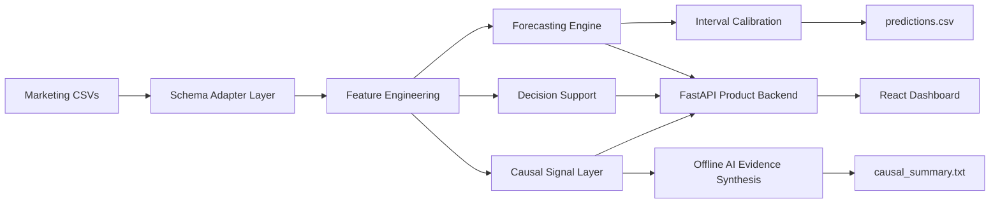

# ForecastIQ

## Grading Contract Verification

`run.sh` is tested end-to-end in CI against empty, malformed, single-source,
and multi-source held-out-style inputs; see
[`tests/test_run_sh_contract.py`](./tests/test_run_sh_contract.py). The
root `Dockerfile` mirrors the same evaluator-only path and is smoke-tested in
Evaluator CI.

These guarantees were refreshed on the current main lineage after
`6f557a9dd0b0f9d025c443396f75a803caa7d8ad`; the fastest trust check is
`python -m pytest tests/test_run_sh_contract.py -q`.

## Exact Evaluator Command

```bash
pip install -r requirements.txt
chmod +x run.sh
./run.sh ./data ./pickle/model.pkl ./output/predictions.csv
```

`run.sh` uses `.venv/Scripts/python.exe` or `.venv/bin/python` when an existing
project virtual environment is present; otherwise it selects `py -3`,
`python3`, or `python`, in that order when available. Install
`requirements.txt` with the same interpreter that runs the evaluator. Graders
can select it explicitly through `PYTHON`, for example on Linux or Git Bash:

```bash
PYTHON=python3 ./run.sh ./data ./pickle/model.pkl ./output/predictions.csv
```

## Which Requirements File Do I Need?

**The automated grading pipeline only ever installs requirements.txt and runs run.sh; everything else in this repo is optional and irrelevant to grading.**

Use `requirements.txt` for the graded offline evaluator only. Use
`requirements-app.txt` only for the full FastAPI app, Gemini/live insights,
tests, and local frontend demo.

[](https://github.com/VINAY-KUMAR-PY/ignite-forecast-iq/actions/workflows/evaluator-ci.yml)

## Repository

Clone: `git clone https://github.com/VINAY-KUMAR-PY/ignite-forecast-iq.git`
Live demo: https://ignite-forecast-iq.vercel.app

## 30-Second Judge Summary

ForecastIQ turns ecommerce marketing CSV exports into 30/60/90-day revenue and
ROAS forecasts, confidence intervals, anomaly/causal diagnostics, and budget
recommendations. The graded artifact is intentionally simple and offline:
`run.sh` loads `pickle/model.pkl`, reads CSVs from `data/`, writes
`predictions.csv`, writes `causal_summary.txt`, and exits without servers,
Gemini, frontend dependencies, or network calls.

Build environment: Python 3.14.4 with pandas 2.3.3, numpy 2.3.5,
scikit-learn 1.7.2, scipy 1.17.1, joblib 1.5.3, threadpoolctl 3.6.0,
narwhals 2.22.1, and packaging 24.1.

Current committed sample output includes all required forecast grains:

| Grain | Example | Horizon | Expected revenue | Revenue range | Expected ROAS |
|---|---|---:|---:|---:|---:|
| Overall | all | 90d | $1,407,079 | $1,197,278-$1,616,880 | 4.05x |
| Channel | Microsoft Ads | 90d | $213,676 | $180,330-$247,022 | 5.40x |
| Campaign type | Advantage+ | 90d | $161,610 | $128,339-$194,881 | 3.03x |
| Campaign | Brand Search | 30d | $84,058 | $73,924-$94,193 | 5.33x |

Example decision: Google Ads shows low-confidence directional
underperformance around the June 11 ROAS anomaly (`p=0.185`), while Microsoft
Ads has the strongest ROAS. A marketer can test shifting $10,000 from Google
Ads to Microsoft Ads; the simulator projects 90-day revenue moving from
$1,428,350 to $1,434,421, about $6,071 incremental revenue, while total spend
stays unchanged.

## Deliverables Map

| Brief deliverable | ForecastIQ artifact |
|---|---|
| Working Prototype | `run.sh`, `pickle/model.pkl`, `backend/predict.py`, FastAPI + React app |
| Technical Documentation | [TECHNICAL.md](./TECHNICAL.md) |
| Architecture Overview | [ARCHITECTURE.md](./ARCHITECTURE.md) |
| Demo Workflow | [DEMO_GUIDE.md](./DEMO_GUIDE.md) and the one-click demo path |

Campaign-level and channel-level budget elasticity, saturation curves,
scenario simulation, and budget optimization are implemented through
`backend/forecasting.py` and `backend/decision_support.py`.

## System Architecture



Core Flow:

1. `run.sh` loads CSV files from `data/` and normalizes them through schema adapters.
2. Feature engineering creates channel, campaign-type, campaign, and time-series signals.
3. The forecasting engine writes calibrated 30/60/90-day forecasts to `predictions.csv`.
4. Causal signals and offline AI evidence synthesis write `causal_summary.txt` for business interpretation.

## Forecast Accuracy At A Glance

Latest regenerated walk-forward revenue interval coverage is
**95.83% / 90.28% / 86.11%** for 30/60/90-day selected planning intervals. Revenue MAPE is
**2.81% / 10.11% / 7.89%** for 30/60/90 days; pooled ROAS MAPE is
**1.26% / 1.56% / 2.46%**. Full tables:
[reports/backtest_summary.md](./reports/backtest_summary.md).

Backend coverage is **93.69% measured locally** with
`python -m pytest tests -q --cov=backend --cov-report=term-missing`; Evaluator CI
enforces **92.05%** with `--cov-fail-under=92.05`.

The reported local result is from Windows with Python 3.14.4: **252 passed, 2
skipped**, with SHAP intentionally unavailable on Python 3.14 and two
POSIX-shell-only tests skipped on Windows. Test totals can vary slightly by
supported Python version and OS because SHAP-dependent behavior runs where
SHAP is installed and POSIX contract tests run on Linux. The canonical GitHub
Actions result and enforced coverage gate remain the submission source of
truth.

ForecastIQ uses a horizon champion-challenger policy: 30-day revenue planning
uses the trained residual model, while 60/90-day revenue planning is
baseline-anchored when rolling-origin evidence says that is safer. In the UI,
`lower_revenue`, `expected_revenue`, and `upper_revenue` are described as
P10-style downside, P50-style expected, and P90-style upside planning bounds.
The Budget Simulator also plots an Efficient Frontier so judges can compare
spend, revenue, ROAS, uncertainty, and recommended balanced options.

## See Live AI Reasoning In 30 Seconds

The graded `run.sh` path is offline-safe by default. The evaluator prints an
`AI MODE` banner and writes the same convention at the top of
`causal_summary.txt`: `OFFLINE DETERMINISTIC MODE — set GEMINI_API_KEY for
live Gemini reasoning` means input-conditioned offline synthesis, while
`LIVE_GEMINI_AUTOMATIC_ENRICHMENT` means `GEMINI_API_KEY` was present and one
bounded Gemini call was attempted with a redacted request/response transcript.
To see real Gemini causal reasoning in
the separate demo script, add `GEMINI_API_KEY` to `.env` and run:

```bash
npm run demo:ai
```

The script calls Gemini for three scenarios: anomaly explanation, budget
reallocation, and channel underperformance. It saves redacted transcripts to
`docs/gemini_sample_transcripts/`. A committed example with independent
`llmHypothesisRanking` evidence is
[`live_gemini_transcript_20260705T051036Z.json`](./docs/gemini_sample_transcripts/live_gemini_transcript_20260705T051036Z.json).
More transcript guidance is in
[docs/gemini_sample_transcripts/README.md](./docs/gemini_sample_transcripts/README.md).
A manual/nightly workflow,
[`gemini-transcript-refresh.yml`](./.github/workflows/gemini-transcript-refresh.yml),
can regenerate one fresh redacted transcript when `GEMINI_API_KEY` is configured.
That workflow is optional maintenance only: missing Gemini secrets or provider
unavailability should skip transcript refresh without affecting evaluator CI,
because the graded path is offline-safe and never requires Gemini or network
access.

## Evaluation Criteria Mapping

| Criterion | Fast verification path |
|---|---|
| Technical Soundness | `./run.sh`, horizon champion-challenger policy in `reports/backtest_summary.md`, `reports/interval_calibration_report.json`, `reports/model_card.md`, `tests/test_offline_predict.py`, `tests/test_interval_monotonicity.py` |
| Practical Relevance | `backend/decision_support.py`, `scripts/validate_budget_elasticity.py`, `reports/budget_elasticity_summary.md`, simulator UI |
| AI Integration | Graded path: per-run offline synthesis plus automatic one-call Gemini enrichment when `GEMINI_API_KEY` is present, with redacted request/response evidence in `output/causal_summary.txt`; demo path: live Gemini calls through `npm run demo:ai`, `scripts/demo_live_ai_reasoning.py`, and `docs/gemini_sample_transcripts/SCENARIO_COVERAGE.md`. |
| Product Thinking | One-click demo flow, Upload -> Dashboard -> Forecast -> Simulator -> Insights, `DEMO_GUIDE.md` |
| Engineering Quality | Evaluator CI, frontend tests, Playwright flow, coverage gate, pinned evaluator dependencies |
| Independent reproduction | `npm run verify` regenerates interval calibration, rolling-origin backtest reports, coverage summary, and `reports/verification_summary.json` |

## Verify In 60 Seconds

```bash
pip install -r requirements.txt
./run.sh ./data ./pickle/model.pkl ./output/predictions.csv

pip install -r requirements-app.txt
npm install
npm run verify

python -m pytest
npm run test
npm run check
npm run build
```

For hidden-data confidence, `tests/test_run_sh_contract.py` also runs `run.sh`
against empty, malformed, multi-source, unusual-filename, larger-row-count, and
unseen-channel fixtures.

## One-Click Demo

```bash
pip install -r requirements-app.txt
npm install
npm run api
npm run dev
```

Open the frontend and click **Try Live Demo** to load sample campaign data and
walk through Dashboard -> Forecast -> Budget Simulator -> AI Insights.

## Documentation Map

- [TECHNICAL.md](./TECHNICAL.md): methodology, model selection, features,
  assumptions, interval calibration, AI architecture, operations, and evidence.
- [ARCHITECTURE.md](./ARCHITECTURE.md): standalone frontend/backend,
  forecasting-pipeline, and LLM workflow architecture overview.
- [DEMO_GUIDE.md](./DEMO_GUIDE.md): demo walkthrough.
- [PRESENTATION_GUIDE.md](./PRESENTATION_GUIDE.md): presentation framing.
- [reports/latest_verification.md](./reports/latest_verification.md): latest
  local validation transcript.
- [docs/gemini_sample_transcripts](./docs/gemini_sample_transcripts): redacted
  live Gemini evidence and offline reasoning provenance.

## Output Contract

`predictions.csv` columns:

```text
level, segment, horizon_days, expected_revenue, lower_revenue, upper_revenue,
expected_roas, lower_roas, upper_roas, model_type, interval_width_pct,
forecast_confidence
```

The committed sample output has 54 rows, horizons `{30, 60, 90}`, no NaN, no
infinite values, **18 `trained_model` rows**, **36
`trained_model_baseline_anchored` rows**, and **0 confidence inversions**.
The 30-day planning forecast uses the trained residual model. The 60/90-day
revenue planning forecasts are baseline-anchored because rolling-origin
evidence shows the seasonal baseline is safer at those horizons; the decision
is generated in `reports/backtest_summary.md` and summarized in
`reports/model_card.md`.

## Deployment

Frontend:

- Deploy the Vite app to Vercel or Netlify.
- Set `VITE_API_BASE_URL` to the deployed backend URL.

Backend:

- Deploy FastAPI to Render or Railway.
- Start command:

```bash
python -m uvicorn backend.main:app --host 0.0.0.0 --port $PORT
```

Environment variables:

```text
GEMINI_API_KEY          optional; enables live Gemini insights
GEMINI_MODEL            optional; defaults to gemini-2.5-flash
TRAINING_ADMIN_TOKEN    required for protected model training endpoint
CORS_ORIGINS            comma-separated production frontend origins
```

Health check: `/health`

## Repository Map

```text
backend/       FastAPI, forecasting, evaluator CLI, Gemini, schema adapters
src/           React app routes, dashboard, upload, forecast, simulator, insights
tests/         Backend, evaluator, schema, Gemini, and Playwright tests
scripts/       Verification, Gemini demo, and synthetic fixture utilities
reports/       Backtest, interval calibration, coverage, and validation reports
pickle/        Committed evaluator model artifact
output/        Sample predictions and causal summary
```
