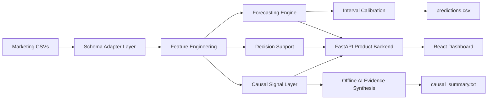

# ForecastIQ

ForecastIQ gives ecommerce marketing teams audit-ready 30/60/90-day revenue
and ROAS planning ranges from CSV exports, with uncertainty and spend
guardrails tied to reproducible offline evidence.

## 30-Second Judge Summary

| Judge question | ForecastIQ answer |
| --- | --- |
| Problem solved | Marketing exports show what happened but do not give an auditable forward plan with uncertainty. |
| Primary user | Ecommerce growth and performance-marketing managers deciding where and when to spend. |
| Inputs | One or more GA4, Shopify, Ads, Microsoft/Bing, canonical, or generic marketing CSV exports. |
| Outputs | A fixed 12-column `predictions.csv` plus causal and explainability notes at overall, channel, campaign-type, and campaign grains. |
| Horizons | 30, 60, and 90 days for expected revenue, ROAS, and downside/upside planning bounds. |
| Decision supported | Compare channel outlooks, test budget reallocations, and stop unsupported spend extrapolation before execution. |
| Differentiator | An offline committed artifact, horizon-specific champion-challenger policy, calibrated intervals, and evidence-linked decision guardrails in one evaluator-safe workflow. |
| Verified headline | 54 rows; revenue MAPE 2.81% / 10.11% / 7.89%; ROAS MAPE 1.26% / 1.56% / 2.46%; interval coverage 95.83% / 90.28% / 86.11%. |

The graded path is intentionally simple: `run.sh` loads `pickle/model.pkl`,
normalizes CSVs from `data/`, writes `predictions.csv`, `causal_summary.txt`,
and `explainability_notes.txt`, then exits without servers, frontend
dependencies, Gemini, or network access.

| Grain         | Example       | Horizon | Expected revenue |         Revenue range | Expected ROAS |
| ------------- | ------------- | ------: | ---------------: | --------------------: | ------------: |
| Overall       | all           |     90d |       $1,407,079 | $1,197,278-$1,616,880 |         4.05x |
| Channel       | Microsoft Ads |     90d |         $213,676 |     $180,330-$247,022 |         5.40x |
| Campaign type | Advantage+    |     90d |         $161,610 |     $128,339-$194,881 |         3.03x |
| Campaign      | Brand Search  |     30d |          $84,058 |       $73,924-$94,193 |         5.33x |

Example decision: Google Ads shows low-confidence directional
underperformance around the June 11 ROAS anomaly (`p=0.185`), while Microsoft
Ads has the strongest ROAS. A marketer can test shifting $10,000 from Google
Ads to Microsoft Ads; the simulator projects 90-day revenue moving from
$1,428,350 to $1,434,421, about $6,071 incremental revenue, while total spend
stays unchanged.

## Verified Results Scorecard

The compact view below is generated or copied from canonical committed
evidence; [`reports/judge_scorecard.json`](./reports/judge_scorecard.json) is
the machine-readable version.

| Verified result | Canonical value | Source |
| --- | ---: | --- |
| Evaluator rows | 54 | [`output/predictions.csv`](./output/predictions.csv), [`verification_summary.json`](./reports/verification_summary.json) |
| Output schema | 12 ordered columns | [`output/predictions.csv`](./output/predictions.csv), [`backtest_report.json`](./reports/backtest_report.json) |
| Forecast horizons | 30 / 60 / 90 days | [`output/predictions.csv`](./output/predictions.csv), [`backtest_summary.md`](./reports/backtest_summary.md) |
| Revenue MAPE by horizon | 2.81% / 10.11% / 7.89% | [`backtest_summary.md`](./reports/backtest_summary.md) |
| ROAS MAPE by horizon | 1.26% / 1.56% / 2.46% | [`backtest_summary.md`](./reports/backtest_summary.md) |
| Revenue interval coverage | 95.83% / 90.28% / 86.11% | [`interval_calibration_report.json`](./reports/interval_calibration_report.json) |
| Model paths | 18 trained / 36 baseline-anchored | [`output/predictions.csv`](./output/predictions.csv), [`final_submission_audit.md`](./reports/final_submission_audit.md) |
| Backend tests and coverage | 293 passed, 2 skipped; 94.01% | [`verification_summary.json`](./reports/verification_summary.json), [`final_submission_audit.md`](./reports/final_submission_audit.md) |
| Frontend tests | 38 passed across 11 files | [`verification_summary.json`](./reports/verification_summary.json), [`final_submission_audit.md`](./reports/final_submission_audit.md) |
| Playwright tests | 3 passed | [`verification_summary.json`](./reports/verification_summary.json), [`final_submission_audit.md`](./reports/final_submission_audit.md) |
| Normalized prediction SHA-256 | `f72c4854098ef5bb382162c66c74a1ef692cda33c1dc4c08c19c7cdf1c2f1362` | [`output/predictions.csv`](./output/predictions.csv), [`final_submission_audit.md`](./reports/final_submission_audit.md) |
| Supported source families | GA4; Shopify; Google/Meta/Microsoft/Bing Ads; canonical/generic CSV | [`final_submission_audit.md`](./reports/final_submission_audit.md) |

The committed output contains 18 `trained_model` rows and 36 `trained_model_baseline_anchored`
rows; line-ending-normalized content is the hash comparison basis.

## Why ForecastIQ Is Different

- It exposes uncertainty, model-path selection, data quality, and spend-support
  risk instead of presenting a point forecast as certainty.
- It joins forecasting with a decision layer: budget scenarios are constrained
  by historical support and compared with interval noise before being called
  actionable.
- It separates deterministic evaluator evidence, observational causal
  hypotheses, and optional language-model explanation with explicit provenance.

The committed scikit-learn artifact is the evaluator source of truth. The
horizon champion-challenger policy decides whether trained or baseline-anchored
revenue is safer at each horizon. Optional app-only XGBoost supports interactive
diagnostics and does not replace the graded artifact. This separation is
intentional dependency and reliability governance, not an inconsistency.

## Deliverables / Evaluation Criteria Map

| Deliverable or criterion | Strongest artifact |
| --- | --- |
| Working Prototype | `run.sh`, `pickle/model.pkl`, `backend/predict.py`, and the FastAPI + React product |
| Technical Documentation | [`TECHNICAL.md`](./TECHNICAL.md) and [`reports/model_card.md`](./reports/model_card.md) |
| Architecture Overview | [`ARCHITECTURE.md`](./ARCHITECTURE.md) |
| Technical Soundness | [`reports/backtest_summary.md`](./reports/backtest_summary.md), [`reports/interval_calibration_report.json`](./reports/interval_calibration_report.json), contract tests |
| Practical Relevance | `backend/decision_support.py`, [`reports/budget_elasticity_summary.md`](./reports/budget_elasticity_summary.md), support-zone guardrails |
| AI Integration | Deterministic causal synthesis plus the validated redacted transcript in [`docs/gemini_sample_transcripts`](./docs/gemini_sample_transcripts) |
| Product Thinking | Data Readiness, forecast evidence, scenario comparison, stop conditions, and evidence export |
| Engineering Quality | [`reports/verification_summary.json`](./reports/verification_summary.json), evaluator CI, Vitest, Playwright, pinned evaluator dependencies |

Campaign-level and channel-level budget elasticity, saturation curves,
scenario simulation, and budget optimization are implemented through
`backend/forecasting.py` and `backend/decision_support.py`. The simulator
supports automatic total-budget allocation and manual channel budgets; each
plan includes historical spend-support zones, safe ceilings, and a verdict that
compares projected gain with forecast uncertainty.

## Exact Evaluator Command

```bash
pip install -r requirements.txt
chmod +x run.sh
./run.sh ./data ./pickle/model.pkl ./output/predictions.csv
```

`run.sh` uses `.venv/Scripts/python.exe` or `.venv/bin/python` when an existing
project virtual environment is present; otherwise it selects `py -3`,
`python3`, or `python`, in that order when available. Install
`requirements.txt` with the same interpreter that runs the evaluator. Graders
can select it explicitly through `PYTHON`, for example on Linux or Git Bash:

```bash
PYTHON=python3 ./run.sh ./data ./pickle/model.pkl ./output/predictions.csv
```

## Grading Contract Verification

`run.sh` is tested end-to-end in CI against empty, malformed, single-source,
and multi-source held-out-style inputs; see
[`tests/test_run_sh_contract.py`](./tests/test_run_sh_contract.py). The root
`Dockerfile` mirrors the evaluator-only path and is smoke-tested in Evaluator
CI. The fastest trust check is
`python -m pytest tests/test_run_sh_contract.py -q`.

The automated grading pipeline installs only `requirements.txt` and runs
`run.sh`; `requirements-app.txt` is additive for the product app, optional
Gemini integration, frontend, and tests.

[](https://github.com/VINAY-KUMAR-PY/ignite-forecast-iq/actions/workflows/evaluator-ci.yml)

## Assumptions and Limitations Summary

Uploaded sources must share a currency and unit scale. Duplicate rows are
aggregated at the canonical grain; negative spend/revenue rows are rejected;
revenue-only inputs may use clearly labeled estimated spend. Thin or stale
history, unknown channels, and single-source data reduce available evidence.
The current 60/90-day revenue path is baseline-anchored, 90-day interval
coverage is lower than the shorter horizons, causal findings are observational,
Gemini is optional, and budgets outside historical support are extrapolations.
See the single detailed ledger in [`TECHNICAL.md`](./TECHNICAL.md#assumptions--limitations).

## Which Requirements File Do I Need?

Use `requirements.txt` for the graded offline evaluator only. Use
`requirements-app.txt` only for the full FastAPI app, Gemini/live insights,
tests, and local frontend demo.

Build environment: Python 3.14.4 with pandas 2.3.3, numpy 2.3.5,
scikit-learn 1.7.2, scipy 1.17.1, joblib 1.5.3, threadpoolctl 3.6.0,
narwhals 2.22.1, and packaging 24.1.

## Repository

Clone: `git clone https://github.com/VINAY-KUMAR-PY/ignite-forecast-iq.git`
Optional product URL: https://ignite-forecast-iq.vercel.app

## Data Readiness Score

Every validated upload receives a deterministic **Data Readiness Score from
0-100** before it is used for planning. The same persisted assessment appears
on Data Upload, the Executive Decision Center, and the Forecast confidence
explanation. It reports a text rating, component scores, positive evidence,
warnings, corrective actions, and an expandable methodology panel; if the API
is unavailable, the UI says the score is unavailable instead of inventing a
browser-only result.

The weighted score reuses the existing schema adapter, row validator,
multi-source reconciliation, and anomaly detector:

| Component                  | Weight | Main evidence                                                    |
| -------------------------- | -----: | ---------------------------------------------------------------- |
| Schema and required fields |    20% | Date/spend/revenue mapping and adapter confidence                |
| Completeness and validity  |    20% | Missing, invalid numeric/date, negative, and inconsistent values |
| Historical coverage        |    20% | Date-range length and cross-source date consistency              |
| Freshness                  |    10% | Latest valid date versus the displayed evaluation date           |
| Channel/campaign coverage  |    10% | Usable channels, campaigns, and campaign types                   |
| Spend/revenue consistency  |    10% | Positive spend and revenue row coverage                          |
| Outliers and duplicates    |    10% | Existing severe-anomaly evidence and duplicate rows/files        |

Ratings are **Excellent** (90-100), **Good** (75-89), **Usable with caution**
(60-74), and **Needs attention** (below 60). Historical coverage reaches full
credit at 180 days. Single-source uploads are not penalized for missing
optional sources. The score explains data-driven forecast confidence; it does
not alter predictions, select a model, or guarantee accuracy.

## System Architecture



Core Flow:

1. `run.sh` loads CSV files from `data/` and normalizes them through schema adapters.
2. Feature engineering creates channel, campaign-type, campaign, and time-series signals.
3. The forecasting engine writes calibrated 30/60/90-day forecasts to `predictions.csv`.
4. Causal signals and offline AI evidence synthesis write `causal_summary.txt` for business interpretation.

## Forecast Accuracy At A Glance

Latest regenerated walk-forward revenue interval coverage is
**95.83% / 90.28% / 86.11%** for 30/60/90-day selected planning intervals. Revenue MAPE is
**2.81% / 10.11% / 7.89%** for 30/60/90 days; pooled ROAS MAPE is
**1.26% / 1.56% / 2.46%**. Full tables:
[reports/backtest_summary.md](./reports/backtest_summary.md).

Backend coverage is **94.01% measured locally** with
`python -m pytest tests -q --cov=backend --cov-report=term-missing`; Evaluator CI
enforces **92.05%** with `--cov-fail-under=92.05`.

The reported local result is from Windows with Python 3.14.4: **293 passed, 2
skipped**, with SHAP intentionally unavailable on Python 3.14 and two
POSIX-shell-only tests skipped on Windows. Test totals can vary slightly by
supported Python version and OS because SHAP-dependent behavior runs where
SHAP is installed and POSIX contract tests run on Linux. The canonical GitHub
Actions result and enforced coverage gate remain the submission source of
truth.

ForecastIQ uses a horizon champion-challenger policy: 30-day revenue planning
uses the trained residual model, while 60/90-day revenue planning is
baseline-anchored when rolling-origin evidence says that is safer. In the UI,
`lower_revenue`, `expected_revenue`, and `upper_revenue` are described as
P10-style downside, P50-style expected, and P90-style upside planning bounds.
The Budget Simulator also plots an Efficient Frontier so judges can compare
spend, revenue, ROAS, uncertainty, and recommended balanced options.

## See Live AI Reasoning In 30 Seconds

The graded `run.sh` path is offline-safe by default. The evaluator prints an
`AI MODE` banner and writes the same convention at the top of
`causal_summary.txt`: `OFFLINE DETERMINISTIC MODE — set GEMINI_API_KEY for
live Gemini reasoning` means input-conditioned offline synthesis, while
`LIVE_GEMINI_AUTOMATIC_ENRICHMENT` means `GEMINI_API_KEY` was present and one
bounded Gemini call was attempted with a redacted request/response transcript.
To see real Gemini causal reasoning in
the separate demo script, add `GEMINI_API_KEY` to `.env` and run:

```bash
npm run demo:ai
```

The script calls Gemini for three scenarios: anomaly explanation, budget
reallocation, and channel underperformance. It saves redacted transcripts to
`docs/gemini_sample_transcripts/`. A committed example with independent
`llmHypothesisRanking` evidence is
[`live_gemini_transcript_20260718T053954Z.json`](./docs/gemini_sample_transcripts/live_gemini_transcript_20260718T053954Z.json).
More transcript guidance is in
[docs/gemini_sample_transcripts/README.md](./docs/gemini_sample_transcripts/README.md).
A transcript's capture timestamp records when it was produced; its committed
presence is not presented as a claim about current provider freshness.

Live Gemini execution is optional; committed redacted transcripts provide
reproducible evidence of the live reasoning path, while the evaluator remains
offline-safe.

A manual/nightly workflow,
[`gemini-transcript-refresh.yml`](./.github/workflows/gemini-transcript-refresh.yml),
can regenerate one fresh redacted transcript when `GEMINI_API_KEY` is configured.
That workflow is optional maintenance only: missing Gemini secrets or provider
unavailability should skip transcript refresh without affecting evaluator CI,
because the graded path is offline-safe and never requires Gemini or network
access.

## Verify In 60 Seconds

```bash
pip install -r requirements.txt
./run.sh ./data ./pickle/model.pkl ./output/predictions.csv

pip install -r requirements-app.txt
npm install
npm run verify

python -m pytest
npm run test
npm run check
npm run build
```

For hidden-data confidence, `tests/test_run_sh_contract.py` also runs `run.sh`
against empty, malformed, multi-source, unusual-filename, larger-row-count, and
unseen-channel fixtures.

## One-Click Demo

```bash
pip install -r requirements-app.txt
npm install
npm run api
npm run dev
```

Open the frontend and click **Try Live Demo** to load sample campaign data and
walk through Dashboard -> Forecast -> Budget Simulator -> AI Insights.

## Product Evidence And Decision Support

The Forecast page now exposes a generated Forecast Evidence Panel with revenue
MAPE, ROAS MAPE, interval coverage, champion path, challenger result, artifact
version, artifact training period, verification date, and deterministic/offline
status. `scripts/generate_model_validation_metadata.mjs` reads the committed
backtest, calibration, evaluator verification, artifact metadata, predictions,
and sample training rows; the UI does not contain hand-entered model metrics.

For the selected forecast, ForecastIQ also compares the previous comparable
period with expected revenue, ROAS, bounds, percentage change, and independently
requested channel forecasts. Confidence names both supporting and reducing
factors from Data Readiness, history, freshness, missingness, interval width,
sample count, model path, and the latest planning zone. Local contribution bars
reuse the backend's permutation effects and are explicitly not presented as an
additive revenue reconciliation.

The simulator adds an Action Priority Matrix and five-plan comparison: current,
automatic, optimized, conservative, and growth. A plan is marked **Best
supported** by evidence-zone strength and uncertainty significance before
expected upside. The Insights page can download a versioned ForecastIQ Evidence
Bundle JSON containing the executive report, selected-view predictions CSV,
scenario evidence, Data Readiness report, model evidence, causal hypotheses,
limitations, and provenance/configuration. Missing workflow sections carry an
actionable next step rather than invented evidence.

## Documentation Map

- [TECHNICAL.md](./TECHNICAL.md): methodology, model selection, features,
  assumptions, interval calibration, AI architecture, operations, and evidence.
- [ARCHITECTURE.md](./ARCHITECTURE.md): standalone frontend/backend,
  forecasting-pipeline, and LLM workflow architecture overview.
- [DEMO_GUIDE.md](./DEMO_GUIDE.md): demo walkthrough.
- [PRESENTATION_GUIDE.md](./PRESENTATION_GUIDE.md): presentation framing.
- [reports/latest_verification.md](./reports/latest_verification.md): latest
  local validation transcript.
- [docs/gemini_sample_transcripts](./docs/gemini_sample_transcripts): redacted
  live Gemini evidence and offline reasoning provenance.

## Output Contract

`predictions.csv` columns:

```text
level, segment, horizon_days, expected_revenue, lower_revenue, upper_revenue,
expected_roas, lower_roas, upper_roas, model_type, interval_width_pct,
forecast_confidence
```

The committed sample output has 54 rows, horizons `{30, 60, 90}`, no NaN, no
infinite values, **18 `trained_model` rows**, **36
`trained_model_baseline_anchored` rows**, and **0 confidence inversions**.
The 30-day planning forecast uses the trained residual model. The 60/90-day
revenue planning forecasts are baseline-anchored because rolling-origin
evidence shows the seasonal baseline is safer at those horizons; the decision
is generated in `reports/backtest_summary.md` and summarized in
`reports/model_card.md`.

## Deployment

Frontend:

- Deploy the Vite app to Vercel or Netlify.
- Set `VITE_API_BASE_URL` to the deployed backend URL.

Backend:

- Deploy FastAPI to Render or Railway.
- Start command:

```bash
python -m uvicorn backend.main:app --host 0.0.0.0 --port $PORT
```

Environment variables:

```text
GEMINI_API_KEY          optional; enables live Gemini insights
GEMINI_MODEL            optional; defaults to gemini-2.5-flash
TRAINING_ADMIN_TOKEN    required for protected model training endpoint
CORS_ORIGINS            comma-separated production frontend origins
```

Health check: `/health`

## Repository Map

```text
backend/       FastAPI, forecasting, evaluator CLI, Gemini, schema adapters
src/           React app routes, dashboard, upload, forecast, simulator, insights
tests/         Backend, evaluator, schema, Gemini, and Playwright tests
scripts/       Verification, Gemini demo, and synthetic fixture utilities
reports/       Backtest, interval calibration, coverage, and validation reports
pickle/        Committed evaluator model artifact
output/        Sample predictions and causal summary
```
