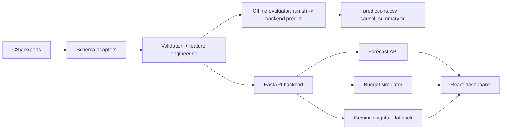

# ForecastIQ

## Which Requirements File Do I Need?

Use `requirements.txt` for the offline evaluator only: `./run.sh ./data ./pickle/model.pkl ./output/predictions.csv`. Use `requirements-app.txt` only for the full FastAPI app, Gemini/live insights, tests, and local frontend demo. The graded evaluator path does not need frontend packages, Gemini, servers, or internet access.

## Forecast Accuracy At A Glance

Latest walk-forward interval coverage is **100.0%** for 30/60/90-day trained revenue intervals.
Revenue MAPE is **2.23% / 9.54% / 7.89%** for 30/60/90 days; overall-level ROAS MAPE is **0.36% / 0.63% / 0.91%**.
Full tables: [reports/backtest_summary.md](./reports/backtest_summary.md).

[](https://github.com/VINAY-KUMAR-PY/ignite-forecast-iq/actions/workflows/evaluator-ci.yml)

## Repository
Clone: `git clone https://github.com/VINAY-KUMAR-PY/ignite-forecast-iq.git`
Live demo: https://ignite-forecast-iq.vercel.app

Backend coverage: **92.05% measured locally** with `python -m pytest tests/ -q --cov=backend --durations=10`; the Evaluator CI `Run tests with coverage` step enforces **90.30%** with `--cov-fail-under=90.30`.
The canonical Evaluator CI workflow writes backend coverage and frontend validation snapshots to the GitHub Actions job summary on every run.

ForecastIQ is an AI-powered ecommerce forecasting and budget-decision platform built for NetElixir AIgnition 3.0. It turns GA4, Shopify, Google Ads, Meta Ads, and Microsoft/Bing Ads CSV exports into revenue forecasts, ROAS forecasts, confidence intervals, budget simulations, anomaly signals, and an executive action brief.

## 30-Second Judge Summary

Marketing teams often know what happened in campaigns, but not what budget action to take next. ForecastIQ closes that gap:

- Upload or load demo ecommerce marketing data.
- Validate rows and normalize common GA4, Shopify, and Ads schemas.
- Forecast 30, 60, and 90-day revenue and ROAS at overall, channel, campaign type, and campaign levels.
- Simulate budget moves across Google Ads, Meta Ads, and Microsoft Ads.
- Generate AI insights with Gemini when available and deterministic fallback when unavailable.
- Export an executive-ready decision brief.

The default offline evaluator path is intentionally isolated: it uses `run.sh`, a compact sklearn model artifact, and no servers, Gemini, frontend, or internet. Per the Hackathon Submission Guide Section 8 no-network runtime rule for submitted evaluators, the normal `run.sh` command never calls an LLM; `output/causal_summary.txt` is generated by deterministic distilled reasoning patterns, anomaly signals, and observational DiD evidence.

For automated evaluation, `pickle/model.pkl` is the canonical offline artifact: `run.sh` scores it with the sklearn GradientBoostingRegressor path and writes `predictions.csv`. The live FastAPI app also exposes a richer XGBoost-powered product experience for interactive dashboards and explainability; both paths are benchmarked against the same deterministic baseline in `reports/backtest_summary.md`, so the evaluator evidence is representative of the broader forecasting quality.

### Example Decision

On the committed sample data, ForecastIQ reports a 90-day Meta Ads ROAS range of **2.48x-3.57x** and flags Google Ads underperformance as low-confidence directional evidence: Google Ads revenue fell after the June 11 event with **p=0.185**, so it is a diagnostic signal rather than proven incrementality. A marketer can test a controlled reallocation by moving **$10,000** from Google Ads to Microsoft Ads; the memory-safe spend-response simulator projects 90-day revenue moving from **$1,428,350** to **$1,434,421**, or about **$6,071** incremental revenue, while total spend stays unchanged.

## How AI Is Used (Read This First)

The graded `run.sh` path never calls an LLM, following the hackathon submission guide's no-network-at-grading-time rule. Causal explanations in the graded output are real statistics: difference-in-differences estimates with p-values, confidence intervals, and power checks from `backend/causal_lite.py`. Those statistics are narrated with explanation templates originally authored by Gemini and stored in `backend/gemini_offline_cache.py`, then filled with the current run's evidence. The full product's `/api/insights` endpoint in `backend/gemini.py` calls live Gemini and asks it to independently rank competing causal hypotheses. Redacted live transcripts are committed in `docs/gemini_sample_transcripts/`.

## Evaluation Criteria Mapping

| Criterion | Where to verify |
|---|---|
| Technical Soundness | `backend/predict.py`, `backend/inference.py`, `reports/backtest_summary.md` including the sklearn-vs-live XGBoost consistency table, `tests/test_offline_predict.py`, `tests/test_interval_monotonicity.py`, and the `Pickle compatibility / Python 3.11-3.14` Evaluator CI matrix |
| Practical Relevance | Budget simulator and decision-support evidence in `backend/decision_support.py`, `backend/segment_utils.py`, `scripts/validate_budget_elasticity.py`, `reports/budget_elasticity_summary.md`, `src/routes/app.simulator.tsx`, and `TECHNICAL.md` |
| AI Integration | Offline distilled LLM reasoning in `backend/gemini_offline_cache.py`, causal evidence in `output/causal_summary.txt`, and optional live Gemini `llmHypothesisRanking` checks in `backend/gemini.py`, `scripts/verify_gemini_live.py`, and `docs/gemini_sample_transcripts/` |
| Product Thinking | One-click demo flow, Upload -> Dashboard -> Forecast -> Simulator -> Insights journey, and `DEMO_GUIDE.md` |
| Engineering Quality | Evaluator CI, frontend CI, Playwright flow, 90.30% enforced backend coverage gate, explicit pickle compatibility matrix, `requirements.txt`/`requirements-app.txt` separation |

### Why Not a Larger Platform

The brief says "the focus of the challenge is not building a full SaaS platform." ForecastIQ therefore keeps the FastAPI + React app as an optional demo layer for exploring the workflow, while the graded deliverable remains the deterministic `run.sh` + `pickle/model.pkl` path. That keeps the submission focused on forecast quality, evaluator reliability, and decision support rather than authentication, billing, or multi-tenant SaaS infrastructure.

## Architecture At A Glance



Key technical details:

- Frontend: React 19, TypeScript, TanStack Router, Tailwind, Recharts.
- Backend: FastAPI, Pydantic v2, SlowAPI rate limiting.
- Live forecast path: XGBoost with sklearn fallback.
- Offline evaluator path: joblib sklearn GradientBoostingRegressor artifact at `pickle/model.pkl`.
- AI layer: Gemini via `google-genai`, with deterministic fallback and ranked causal hypotheses.
- Reliability: evaluator-only dependencies are separate from app dependencies.

## One-Click Demo

1. Start backend and frontend:

```bash
pip install -r requirements-app.txt
npm install
npm run api
npm run dev
```

2. Open the frontend and click **Try Live Demo**.

3. Walk through:

```text
Homepage -> Dashboard -> Forecast -> Budget Simulator -> AI Insights
```

The demo uses built-in sample campaign data, so the product can be reviewed without preparing a CSV first.

## Offline Evaluator Command

Use this exact submission-safe path:

```bash
pip install -r requirements.txt
chmod +x run.sh
./run.sh ./data ./pickle/model.pkl ./output/predictions.csv
```

Evaluator scope: this command is the graded artifact. It uses only
`requirements.txt`, reads CSV files from the supplied data folder, loads the
committed `pickle/model.pkl` artifact, writes `predictions.csv` plus companion
notes, and exits without starting servers or making network calls. The FastAPI
app, Gemini live mode, Playwright tests, and frontend dependencies are product
evidence, not dependencies of the automated evaluator.

Optional live-AI causal reasoning check for reviewers with a Gemini key:

```bash
GEMINI_API_KEY=your_key ./run.sh ./data ./pickle/model.pkl ./output/predictions.csv --enable-live-ai
```

If the key is missing, invalid, or Gemini is unavailable, the command still exits safely and keeps the deterministic offline causal summary.

For AI Integration scoring in the offline evaluator, check the first two lines of `output/causal_summary.txt`; they explicitly label the run as `OFFLINE_DETERMINISTIC_FALLBACK` and `DISTILLED_LLM_DERIVED_OFFLINE_CACHE` when no live Gemini call is allowed. Optional live enrichment exists behind `--enable-live-ai`, but that flag is not part of the graded evaluator contract and defaults to off.

Note: `requirements.txt` pins `scikit-learn==1.9.0` to match the committed artifact. The supported evaluator runtime is Python 3.11-3.14 with the exact pinned dependencies; CI requires `model_type=trained_model` across that full matrix.
`requirements.txt` is the minimal offline-evaluator dependency set; `requirements-app.txt` is a superset needed only for running the full FastAPI backend, tests, Gemini integration, and local frontend demo.

The trained `pickle/model.pkl` artifact was rebuilt with Python 3.14.4 and verified on both Windows 11 AMD64 and Ubuntu Linux GitHub Actions runners. Live Gemini output verification is handled by [scripts/verify_gemini_live.py](./scripts/verify_gemini_live.py) and the Gemini Live Smoke workflow; successful secret-backed runs write redacted replayable transcripts to [docs/gemini_sample_transcripts](./docs/gemini_sample_transcripts/). The latest checked-in live transcript is `live_gemini_transcript_20260702T132317Z.json` for `gemini-2.5-flash`; local offline evaluator runs use deterministic fallback only.

Dependency verification evidence from a clean Python 3.14.4 virtual environment:

```text
python -m pip install -r requirements.txt
Successfully installed joblib-1.5.3 narwhals-2.23.0 numpy-2.4.6 packaging-24.1
pandas-3.0.3 python-dateutil-2.9.0.post0 scikit-learn-1.9.0 scipy-1.17.1
six-1.17.0 threadpoolctl-3.6.0 tzdata-2026.2
python 3.14.4
sklearn 1.9.0
artifact_version 5
model_type trained_model
```

The evaluator CI runs the same pinned install on Ubuntu runners for Python 3.11, 3.12, 3.13, and 3.14, then asserts the committed artifact emits `model_type=trained_model`. The **Evaluator CI** badge above includes the dedicated `Pickle compatibility / Python 3.11-3.14` matrix job.

### Reproducibility

The canonical evaluator runtime is the exact pinned dependency set in `requirements.txt`. Linux verification is enforced by `.github/workflows/evaluator-ci.yml`: the `evaluator`, `exact-sklearn-zero-fallback`, and `hackathon-evaluator-protocol` jobs install dependencies fresh on Ubuntu, run the committed artifact, and require `model_type=trained_model` for supported sample and held-out-style data. A separate sklearn drift-tolerance CI job intentionally installs available older sklearn minor versions (`1.7.2` and `1.8.0`; no above-`1.9.0` release is available on the configured package index yet) and requires one of two clear outcomes: valid `trained_model` output, or a loud compatibility warning before any `safe_baseline_fallback` output is accepted. This prevents silent bad predictions when a reviewer experiments outside the pinned runtime.

Model choice note: the offline evaluator uses a compact sklearn
GradientBoostingRegressor artifact because it is deterministic, small enough to
ship in git, and compatible with the no-server/no-network submission contract.
The live XGBoost path exists for the richer app experience and explainability
center; it is not required to reproduce the scored `predictions.csv`.

Expected output:

```text
output/predictions.csv
output/causal_summary.txt
output/explainability_notes.txt
```

Required evaluator schema:

```text
level, segment, horizon_days, expected_revenue, lower_revenue, upper_revenue,
expected_roas, lower_roas, upper_roas, model_type, interval_width_pct,
forecast_confidence
```

The committed sample output has 54 rows, all horizons `{30, 60, 90}`, no NaN, no infinite values, and `model_type=trained_model` on supported Python runtimes.

## Evaluator Reproduction

CI includes a dedicated job named **Hackathon 5-step evaluator protocol** that mirrors the organizer-style evaluation:

1. Fresh checkout.
2. Install only `requirements.txt`.
3. Replace `data/` with a held-out-style synthetic fixture.
4. Run `./run.sh ./data ./pickle/model.pkl ./output/predictions.csv`.
5. Validate exact schema, horizons, finite non-negative numeric values, and non-empty output.

This job is separate from broader backend, frontend, and Playwright checks so the evaluator contract remains easy to audit.

## AI Integration in the Offline Evaluator

Default `run.sh` makes no live Gemini or network call. Instead, `backend/gemini_offline_cache.py` builds a structured causal evidence object from the run's anomaly and DiD statistics, then fills a distilled Gemini-authored explanation skeleton with live computed values such as channel, effect size, confidence, ROAS delta, and limitations. The skeletons are derived from the redacted live Gemini transcripts in `docs/gemini_sample_transcripts/`, and the filled explanation is written into `output/causal_summary.txt` with the label `DISTILLED_LLM_DERIVED_OFFLINE_CACHE`, so the scored artifact shows both the AI reasoning boundary and the evidence used.

Optional live enrichment is available in two explicit ways. For the full app, run `pip install -r requirements-app.txt`, set `GEMINI_API_KEY`, start `python -m uvicorn backend.main:app --host 127.0.0.1 --port 8000`, and call `POST /api/insights`; the response header `X-ForecastIQ-AI-Source: gemini` confirms live Gemini augmented the executive insight response. For a local CLI experiment only, set `GEMINI_API_KEY` and append `--enable-live-ai` after the normal evaluator arguments; if the key is missing, Gemini is unavailable, or app dependencies are absent, `run.sh` still exits safely with the deterministic offline summary.

## Evidence & Validation

ForecastIQ keeps one canonical evidence map here to reduce duplicate documentation.

| Area | Evidence |
|---|---|
| Evaluator contract | `run.sh`, `backend/predict.py`, `backend/evaluator_contract.py`, `tests/test_evaluator_contract.py`, `tests/test_evaluator_e2e.py`, `tests/test_scale_evaluator.py`, `.github/workflows/evaluator-ci.yml` |
| Forecast model | `backend/inference.py`, `pickle/model.pkl`, `reports/backtest_report.json`, `reports/backtest_summary.md`, `reports/coverage_summary.md`, `backend/main.py::model_validation`, `src/components/model-path-confidence-badge.tsx`, `tests/test_interval_monotonicity.py`, `tests/test_offline_predict.py` |
| Budget elasticity | `backend/segment_utils.py::spend_response_multiplier`, `scripts/validate_budget_elasticity.py`, `reports/budget_elasticity_report.json`, `reports/budget_elasticity_summary.md` |
| Data compatibility | `backend/schema_adapters.py`, `backend/data_preprocessing.py`, `tests/test_schema_adapters.py`, `tests/fixtures/ga4_variant_hidden_export.csv` for GA4 variants, Shopify, Google Ads micros, Meta Ads, Microsoft/Bing Ads, and duplicate-revenue guards |
| AI and causal layer | `backend/gemini.py`, `backend/gemini_offline_cache.py`, `backend/causal_lite.py`, `scripts/verify_gemini_live.py`, `.github/workflows/gemini-live-smoke.yml`, `tests/test_gemini_parsing.py`, `tests/test_causal_lite.py`, `tests/test_offline_predict.py`, `output/causal_summary.txt`, `output/explainability_notes.txt`, `docs/gemini_sample_transcripts/` |
| Product demo | `src/routes/index.tsx`, `src/routes/`, `src/routes/app-pages.test.tsx`, `tests/e2e/demo.spec.ts`, `reports/e2e_summary.md`, `DEMO_GUIDE.md`, `TECHNICAL.md` |
| CI jobs | `evaluator`, `pickle-compatibility-matrix`, `sklearn-version-drift-smoke`, `app-tests`, `frontend`, `e2e-demo`, `hackathon-evaluator-protocol`, and `gemini-live-smoke` |
| Exact sklearn guard | `exact-sklearn-zero-fallback` in `.github/workflows/evaluator-ci.yml` installs the pinned evaluator runtime and rejects sklearn mismatch/fallback warnings |

Backtest headline from the latest rolling-origin report:

| Horizon | Revenue MAPE: trained vs seasonal baseline | ROAS MAPE: trained vs seasonal baseline | Verdict |
|---:|---:|---:|---|
| 30 days | 2.23% vs 3.15% | 1.22% vs 1.46% | Trained model wins revenue; ROAS is effectively tied |
| 60 days | 9.54% vs 9.54% | 1.11% vs 1.51% | Revenue ties baseline; trained model wins ROAS |
| 90 days | 7.89% vs 7.89% | 2.04% vs 2.07% | Revenue ties baseline; ROAS is effectively tied |

How to read the table: ties at 60/90-day revenue are intentional horizon-level
model selection, not a hidden fallback. When the rolling-origin report shows
the seasonal baseline is equally reliable for long-horizon revenue, the
artifact keeps that safer anchor while still using trained-model ROAS evidence
where it improves the backtest.

Latest local verification on July 6, 2026:

```text
python -m pip install -r requirements.txt
./run.sh ./data ./pickle/model.pkl ./output/predictions.csv

Requirement already satisfied: pandas==3.0.3
Requirement already satisfied: numpy==2.4.6
Requirement already satisfied: scikit-learn==1.9.0
[ForecastIQ] Trained-model forecast coverage: 54/54 rows (100.0%) used artifact-backed estimates; 0 row(s) used safe segment fallback.
[ForecastIQ] Prediction mode: trained_model
[ForecastIQ] Wrote 54 rows to ./output/predictions.csv
[ForecastIQ] scikit-learn version: 1.9.0 (artifact built on 1.9.0)
[ForecastIQ] Python version: 3.14.4

python -m pip install -r requirements-app.txt
python -m pytest tests/ -q --cov=backend --durations=10
186 passed, 2 skipped, 7 warnings in 202.99s with 92.05% backend coverage

npm ci
added 603 packages, audited 604 packages; 1 low severity vulnerability reported

npm run test && npm run check && npm run build
vitest passed: 4 files, 14 tests in 5.11s
check passed: TypeScript, ESLint, and Vite production build in 6.22s
build passed: Vite transformed 2,787 modules and built in 31.58s

npm run test:e2e
Playwright passed: 1 Chromium workflow covering Upload -> Dashboard -> Forecast -> Model Validation -> Simulator -> Insights
```

Focused timing check for the two previously slow backend test files:

```text
python -m pytest tests/test_causal_stability.py tests/test_decision_support.py -q --durations=20
5 passed in 18.67s; slowest test 15.68s
```

The latest backtest compares trained-model and deterministic-baseline behavior
using MAE, RMSE, MAPE, interval coverage, and per-horizon performance. The
offline model can emit `trained_model`, `trained_model_estimated_spend`, or
`safe_baseline_fallback`; the exact degradation conditions are documented in
[TECHNICAL.md](./TECHNICAL.md).

Known limits: the model does not ingest promotions, inventory, prices, margins,
competitor activity, or macroeconomic signals. The causal layer is
observational DiD evidence, not randomized incrementality. Confidence intervals
are practical planning intervals and should be recalibrated with production
holdout data before real budget commitments.

## Forecasting Methodology

The offline evaluator model is trained on a residual correction over a deterministic baseline. This keeps the model useful while preserving safe fallback behavior for tiny, malformed, or hidden datasets.

Confidence intervals use a split-conformal revenue calibration wrapper,
residual volatility guardrails, horizon-specific widening, and segment-level
widening:

| Horizon | Residual multiplier | Planning floor |
|---|---:|---:|
| 30 days | 1.00 | 5.51% |
| 60 days | 2.7792 | 21.68% |
| 90 days | 2.7792 | 22.18% |

The resulting bands are intentionally conservative for ecommerce media forecasts, especially over 60- and 90-day horizons where seasonality, promotion cadence, auction volatility, and channel mix shifts compound uncertainty. The latest split-conformal calibration uses two pre-final chronological calibration windows and retains 100.0% walk-forward sample coverage; mean trained-model revenue widths are 14.75%, 51.76%, and 57.08% for 30/60/90 days in `reports/backtest_summary.md`.

The interval enforcement layer ensures uncertainty bands widen across horizons and that `interval_width_pct` matches the actual revenue bands. On the committed sample output, overall intervals are now 11.08%, 43.36%, and 45.36% for 30, 60, and 90 days, with confidence labels varying by horizon and segment quality.

ROAS intervals are calibrated independently from historical daily ROAS residuals, with a minimum ROAS floor for thin segments, so `lower_roas` and `upper_roas` are not just revenue confidence bounds divided by projected spend.

Budget overrides in the offline evaluator use a concave spend-response curve: moderate increases can lift revenue, but revenue gains flatten after about 1.5x recent channel spend and ROAS declines under extreme 10x budget scenarios. `scripts/validate_budget_elasticity.py` validates that curve against historical month-over-month spend moves; the latest report covers 12 qualifying channel-month cases with 100.00% direction accuracy and 9.49% revenue-response MAPE.

For full methodology, feature list, assumptions, and limitations, see [TECHNICAL.md](./TECHNICAL.md).

## Data Sources Supported

- GA4: `sessionSource`, `sessionMedium`, `purchaseRevenue`, `eventValue`, `sessions`, `conversions`.
- Shopify: `created_at`, `total_price`, `sales`, `orders`, `product_type`.
- Google Ads: `metrics_cost_micros`, `metrics_clicks`, `metrics_impressions`, `metrics_conversions`, `metrics_conversions_value`, `segments_date`.
- Meta Ads: `date_start`, `spend`, `clicks`, `impressions`, `conversion`, `conversion_value`.
- Microsoft/Bing Ads: `TimePeriod`, `CampaignType`, `CampaignName`, `Spend`, `Revenue`.

Mixed-source folders are reconciled to avoid double-counting revenue. Shopify/order data is treated as revenue-of-record when present.

## Development Commands

```bash
# evaluator only
pip install -r requirements.txt
./run.sh ./data ./pickle/model.pkl ./output/predictions.csv

# backend app
pip install -r requirements-app.txt
python -m pytest
python -m backend.backtest
python -m uvicorn backend.main:app --host 127.0.0.1 --port 8000

# frontend app
npm install
npm run test
npm run check
npm run test:e2e
```

## Deployment

Frontend:

- Deploy the Vite app to Vercel or Netlify.
- Set `VITE_API_BASE_URL` to the deployed backend URL.

Backend:

- Deploy FastAPI to Render or Railway.
- Start command:

```bash
python -m uvicorn backend.main:app --host 0.0.0.0 --port $PORT
```

Environment variables:

```text
GEMINI_API_KEY          optional; enables live Gemini insights
GEMINI_MODEL            optional; defaults to gemini-2.5-flash
TRAINING_ADMIN_TOKEN    required for protected model training endpoint
CORS_ORIGINS            comma-separated production frontend origins
```

Health check:

```text
/health
```

## Repository Map

```text
backend/       FastAPI, forecasting, evaluator CLI, Gemini, schema adapters
src/           React app routes, dashboard, upload, forecast, simulator, insights
tests/         Backend, evaluator, schema, Gemini, and Playwright tests
scripts/       E2E wrapper and synthetic fixture generator
reports/       Backtest report and summary
pickle/        Committed evaluator model artifact
output/        Sample predictions and causal summary
```

Deeper references:

- [TECHNICAL.md](./TECHNICAL.md)
- [DEMO_GUIDE.md](./DEMO_GUIDE.md)
