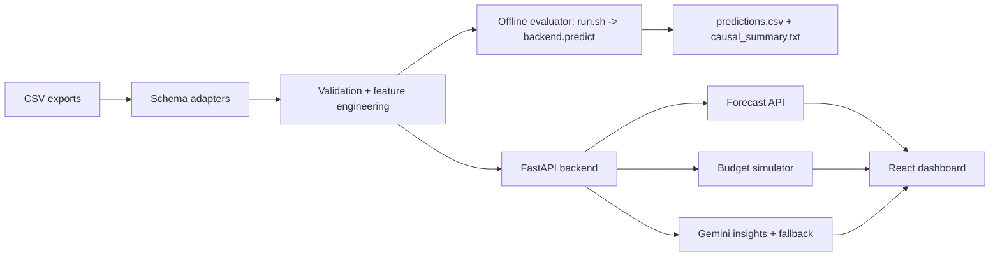

# ForecastIQ

[](https://github.com/VINAY-KUMAR-PY/ignite-forecast-iq/actions/workflows/evaluator-ci.yml)
[](https://github.com/VINAY-KUMAR-PY/ignite-forecast-iq/actions/workflows/frontend-ci.yml)

ForecastIQ is an AI-powered ecommerce forecasting and budget-decision platform built for NetElixir AIgnition 3.0. It turns GA4, Shopify, Google Ads, Meta Ads, and Microsoft/Bing Ads CSV exports into revenue forecasts, ROAS forecasts, confidence intervals, budget simulations, anomaly signals, and an executive action brief.

## 30-Second Judge Summary

Marketing teams often know what happened in campaigns, but not what budget action to take next. ForecastIQ closes that gap:

- Upload or load demo ecommerce marketing data.
- Validate rows and normalize common GA4, Shopify, and Ads schemas.
- Forecast 30, 60, and 90-day revenue and ROAS at overall, channel, campaign type, and campaign levels.
- Simulate budget moves across Google Ads, Meta Ads, and Microsoft Ads.
- Generate AI insights with Gemini when available and deterministic fallback when unavailable.
- Export an executive-ready decision brief.

The offline evaluator path is intentionally isolated: it uses `run.sh`, a compact sklearn model artifact, and no servers, Gemini, frontend, or internet.

## Architecture At A Glance



Key technical details:

- Frontend: React 19, TypeScript, TanStack Router, Tailwind, Recharts.
- Backend: FastAPI, Pydantic v2, SlowAPI rate limiting.
- Live forecast path: XGBoost with sklearn fallback.
- Offline evaluator path: joblib sklearn GradientBoostingRegressor artifact at `pickle/model.pkl`.
- AI layer: Gemini via `google-genai`, with deterministic fallback and ranked causal hypotheses.
- Reliability: evaluator-only dependencies are separate from app dependencies.

## One-Click Demo

1. Start backend and frontend:

```bash
pip install -r requirements-app.txt
npm install
npm run api
npm run dev
```

2. Open the frontend and click **Try Live Demo**.

3. Walk through:

```text
Homepage -> Dashboard -> Forecast -> Budget Simulator -> AI Insights
```

The demo uses built-in sample campaign data, so judges do not need to upload a CSV manually.

## Offline Evaluator Command

Use this exact submission-safe path:

```bash
pip install -r requirements.txt
chmod +x run.sh
./run.sh ./data ./pickle/model.pkl ./output/predictions.csv
```

Note: `requirements.txt` pins `scikit-learn==1.9.0` to match the committed artifact. The supported evaluator runtime is Python 3.11-3.14 with the exact pinned dependencies; CI requires `model_type=trained_model` across that full matrix.

The trained `pickle/model.pkl` artifact was rebuilt and last verified with Python 3.14.4 on Windows 11 AMD64. Live Gemini output verification is handled by [scripts/verify_gemini_live.py](./scripts/verify_gemini_live.py) and the Gemini Live Smoke workflow; successful secret-backed runs write redacted replayable transcripts to [docs/gemini_sample_transcripts](./docs/gemini_sample_transcripts/).

Dependency verification evidence from a clean Python 3.14.4 virtual environment:

```text
python -m pip install -r requirements.txt
Successfully installed joblib-1.5.3 narwhals-2.23.0 numpy-2.4.6 packaging-24.1
pandas-3.0.3 python-dateutil-2.9.0.post0 scikit-learn-1.9.0 scipy-1.17.1
six-1.17.0 threadpoolctl-3.6.0 tzdata-2026.2
python 3.14.4
sklearn 1.9.0
artifact_version 5
model_type trained_model
```

The evaluator CI runs the same pinned install on Ubuntu runners for Python 3.11, 3.12, 3.13, and 3.14, then asserts the committed artifact emits `model_type=trained_model`.

Expected output:

```text
output/predictions.csv
output/causal_summary.txt
```

Required evaluator schema:

```text
level, segment, horizon_days, expected_revenue, lower_revenue, upper_revenue,
expected_roas, lower_roas, upper_roas, model_type, interval_width_pct,
forecast_confidence
```

The committed sample output has 54 rows, all horizons `{30, 60, 90}`, no NaN, no infinite values, and `model_type=trained_model` on supported Python runtimes.

## Evaluator Reproduction

CI includes a dedicated job named **Hackathon 5-step evaluator protocol** that mirrors the organizer-style evaluation:

1. Fresh checkout.
2. Install only `requirements.txt`.
3. Replace `data/` with a held-out-style synthetic fixture.
4. Run `./run.sh ./data ./pickle/model.pkl ./output/predictions.csv`.
5. Validate exact schema, horizons, finite non-negative numeric values, and non-empty output.

This job is separate from broader backend, frontend, and Playwright checks so the evaluator contract remains easy to audit.

## Validation Evidence

Current automated evidence includes:

- Python evaluator matrix: 3.11, 3.12, 3.13, 3.14.
- Dedicated Frontend CI: clean `npm ci`, `npm run test`, and `npm run build`.
- Backend pytest coverage gate: 90%.
- Frontend unit tests: Vitest + React Testing Library.
- Playwright demo flow: Try Live Demo -> Forecast -> Simulator -> Insights.
- Large-data evaluator stress test: synthetic ~50,000-row CSV through `run.sh`.
- Schema adapter edge tests for GA4, Shopify, Google Ads micros, Meta Ads, and Bing/Microsoft Ads.
- Gemini parsing tests with mocked responses and ranked causal hypotheses.
- Live Gemini verification script and workflow: schema-validates real Gemini responses and saves redacted transcripts when `GEMINI_API_KEY` is configured.

See [EVALUATION.md](./EVALUATION.md) for the evidence index linking tests, CI jobs, reports, and transcript validation.

## Forecasting Methodology

The offline evaluator model is trained on a residual correction over a deterministic baseline. This keeps the model useful while preserving safe fallback behavior for tiny, malformed, or hidden datasets.

Confidence intervals use residual calibration with horizon-specific widening:

| Horizon | Multiplier | Floor |
|---|---:|---:|
| 30 days | 1.38 | 10% |
| 60 days | 1.55 | 17% |
| 90 days | 1.80 | 25% |

The interval enforcement layer ensures uncertainty bands widen across horizons and that `interval_width_pct` matches the actual revenue bands.

For full methodology, feature list, assumptions, and limitations, see [TECHNICAL.md](./TECHNICAL.md).

## Data Sources Supported

- GA4: `sessionSource`, `sessionMedium`, `purchaseRevenue`, `eventValue`, `sessions`, `conversions`.
- Shopify: `created_at`, `total_price`, `sales`, `orders`, `product_type`.
- Google Ads: `metrics_cost_micros`, `metrics_clicks`, `metrics_impressions`, `metrics_conversions`, `metrics_conversions_value`, `segments_date`.
- Meta Ads: `date_start`, `spend`, `clicks`, `impressions`, `conversion`, `conversion_value`.
- Microsoft/Bing Ads: `TimePeriod`, `CampaignType`, `CampaignName`, `Spend`, `Revenue`.

Mixed-source folders are reconciled to avoid double-counting revenue. Shopify/order data is treated as revenue-of-record when present.

## Development Commands

```bash
# evaluator only
pip install -r requirements.txt
./run.sh ./data ./pickle/model.pkl ./output/predictions.csv

# backend app
pip install -r requirements-app.txt
python -m pytest
python -m backend.backtest
python -m uvicorn backend.main:app --host 127.0.0.1 --port 8000

# frontend app
npm install
npm run test
npm run check
npm run test:e2e
```

## Deployment

Frontend:

- Deploy the Vite app to Vercel or Netlify.
- Set `VITE_API_BASE_URL` to the deployed backend URL.

Backend:

- Deploy FastAPI to Render or Railway.
- Start command:

```bash
python -m uvicorn backend.main:app --host 0.0.0.0 --port $PORT
```

Environment variables:

```text
GEMINI_API_KEY          optional; enables live Gemini insights
GEMINI_MODEL            optional; defaults to gemini-2.5-flash
TRAINING_ADMIN_TOKEN    required for protected model training endpoint
CORS_ORIGINS            comma-separated production frontend origins
```

Health check:

```text
/health
```

## Repository Map

```text
backend/       FastAPI, forecasting, evaluator CLI, Gemini, schema adapters
src/           React app routes, dashboard, upload, forecast, simulator, insights
tests/         Backend, evaluator, schema, Gemini, and Playwright tests
scripts/       E2E wrapper and synthetic fixture generator
reports/       Backtest report and summary
pickle/        Committed evaluator model artifact
output/        Sample predictions and causal summary
```

Deeper references:

- [TECHNICAL.md](./TECHNICAL.md)
- [ARCHITECTURE.md](./ARCHITECTURE.md)
- [DEMO_GUIDE.md](./DEMO_GUIDE.md)
- [EVALUATION.md](./EVALUATION.md)
- [VALIDATION_NOTES.md](./VALIDATION_NOTES.md)
