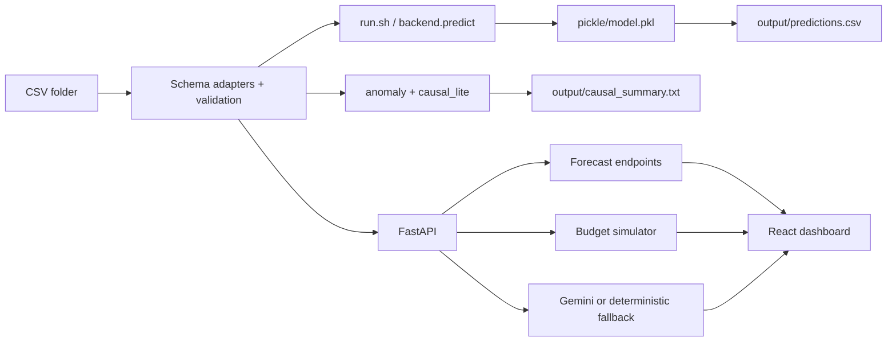

# ForecastIQ Technical Reference

This is the concise methodology document for the NetElixir AIgnition 3.0
submission. Detailed historical tables, older validation transcripts, and
expanded diagrams are preserved in
[docs/technical-appendix.md](./docs/technical-appendix.md).

## Table of Contents

- [Methodology](#methodology)
- [Model Selection](#model-selection)
- [Backtest Accuracy & Interval Calibration](#backtest-accuracy--interval-calibration)
- [Data Preprocessing](#data-preprocessing)
- [Evaluator Contract Compliance](#evaluator-contract-compliance)
- [Known Degradation Paths](#known-degradation-paths)
- [Assumptions & Limitations](#assumptions--limitations)
- [AI Reasoning Architecture](#ai-reasoning-architecture)
- [Architecture Overview](#architecture-overview)
- [Test & Backtest Evidence](#test--backtest-evidence)
- [Operational Security](#operational-security)

## Methodology

ForecastIQ converts ecommerce marketing CSV exports into 30, 60, and 90 day
forecasts at four grains: overall, channel, campaign type, and campaign. The
offline evaluator path reads all CSV files from `data/`, normalizes marketing
schemas, loads the committed `pickle/model.pkl` artifact, writes
`output/predictions.csv`, writes causal/explainability text artifacts, and exits
without servers or network calls.

The live product path exposes the same business workflow through FastAPI and
React: upload, validation, dashboard, forecasts, budget simulator, AI insights,
and executive decision support. The live path may use heavier dependencies such
as XGBoost and Gemini because it is product evidence, not the automated grading
entry point.

### Seasonality Handling

The evaluator model uses daily aggregation plus calendar and rolling-window
features from `backend/segment_utils.py` and `backend/train.py`: day of week,
month of year, recent revenue/spend/ROAS windows, channel and campaign type mix,
lagged trend features, and spend response multipliers. At campaign-type level,
these features allow Search, Shopping, Advantage+, and Retargeting segments to
carry different weekly cadence, recent momentum, and channel-mix behavior.

### Feature Set

The sklearn evaluator artifact uses a compact tabular feature set designed for
hidden CSV compatibility: spend, clicks, impressions, conversions, revenue,
ROAS, rolling daily aggregates, segment encoding, horizon encoding, calendar
features, budget multipliers, and segment health indicators. The live XGBoost
path uses richer interactive diagnostics and feature importance, but the
scored artifact remains deliberately small and deterministic.

## Model Selection

ForecastIQ intentionally uses two model paths:

| Path | Model | Why |
|---|---|---|
| Offline evaluator | sklearn GradientBoostingRegressor residual correction | Small, committed, deterministic, joblib-compatible, and compatible with `requirements.txt`. |
| Live app | XGBoost when available | Better interactive feature importance and non-linear diagnostics for the dashboard. |
| Safe fallback | deterministic seasonal baseline | Prevents crashes on empty, malformed, sparse, or incompatible hidden evaluator data. |

Two paths are safer than one because the evaluator needs reproducible offline
execution while the live app needs richer diagnostics. Both paths are compared
against the same deterministic baseline in `reports/backtest_summary.md`, and
`tests/test_path_consistency.py` enforces directional consistency rather than
pretending both systems will be numerically identical.

Alternatives considered:

| Candidate | Decision | Rationale |
|---|---|---|
| Linear/Ridge regression | Benchmark only | Stable, but too rigid for media saturation and campaign seasonality. |
| Prophet/ETS | Not selected | Strong univariate seasonality, weaker for multi-channel spend and budget simulation. |
| XGBoost | Live app only | Useful for diagnostics, but heavier than the evaluator needs. |
| Quantile regression | Optional interval research path | Good for distributional intervals, but adds artifact complexity for the minimal evaluator. |
| Bayesian structural time series | Future candidate | Valuable for causal stories, but too assumption-sensitive for a hackathon CSV evaluator. |
| Conformal prediction | Natural next interval iteration | Added as a gated calibration option for comparison, while default output remains unchanged. |

### Long-Horizon Revenue Blend Decision

The 30 day revenue model uses trained residual correction because paired
rolling-origin evidence favors the trained signal. At 60 and 90 days, the
trained residual correction statistically ties the seasonal baseline on the
committed sample and can overfit small market windows. ForecastIQ therefore
anchors 60/90 day revenue to the deterministic seasonal baseline inside the
loaded `trained_model` artifact instead of forcing residual correction where the
evidence does not justify it.

The longer-horizon ablation table below is generated from
[reports/long_horizon_revenue_ablation.md](./reports/long_horizon_revenue_ablation.md),
which in turn reads the latest `reports/backtest_report.json` produced by
`python -m backend.backtest`.

| Horizon | Trained MAE | Baseline MAE | Trained RMSE | Baseline RMSE | Trained MAPE | Baseline MAPE | Statistical test | 95% CI | p-value | Verdict |
|---:|---:|---:|---:|---:|---:|---:|---|---:|---:|---|
| 60d | 17906.95 | 17906.95 | 25640.24 | 25640.24 | 9.54% | 9.54% | paired bootstrap absolute-error delta | 0.0000 to 0.0000 | 1.000 | statistical tie |
| 90d | 22141.94 | 22141.94 | 31514.10 | 31514.10 | 7.89% | 7.89% | paired bootstrap absolute-error delta | 0.0000 to 0.0000 | 1.000 | statistical tie |

This is a deliberate model-selection gate, not a hidden failure. The generated
CSV still reports `model_type=trained_model` when the artifact loads and makes
the horizon-level selection. `safe_baseline_fallback` is reserved for runtime
degradation cases such as missing/corrupt model files, empty input, malformed
schemas, or unsupported runtime versions.

## Backtest Accuracy & Interval Calibration

Rolling-origin backtesting is implemented in `backend/backtest.py` and reported
in [reports/backtest_summary.md](./reports/backtest_summary.md). It evaluates
at least three chronological windows where enough history exists, comparing the
trained path against the deterministic baseline on MAE, RMSE, MAPE, interval
coverage, and mean interval width.

Latest committed headline values:

| Horizon | Revenue MAPE | Overall ROAS MAPE | Revenue interval coverage |
|---:|---:|---:|---:|
| 30d | 2.23% | 0.36% | 100.0% |
| 60d | 9.54% | 0.63% | 100.0% |
| 90d | 7.89% | 0.91% | 100.0% |

Coverage is intentionally conservative because ecommerce revenue is noisy over
longer horizons due to seasonality, promotion cadence, channel volatility, and
campaign mix changes. ForecastIQ reports mean interval width beside coverage so
reviewers can see the sharpness/coverage tradeoff rather than only a high
coverage number.

### Interval Calibration Methodology

Default evaluator intervals use residual/conformal calibration constants stored
in `backend/evaluator_intervals.py`. The final prediction writer enforces
monotonic widening so 30 day intervals are never wider than 60 day intervals,
and 60 day intervals are never wider than 90 day intervals for the same segment.
The reported `interval_width_pct` is recomputed from the actual
`lower_revenue`/`upper_revenue` bands, so CSV metadata stays auditable.

An optional calibration profile is available through the
`FORECASTIQ_INTERVAL_METHOD` environment variable. The default remains
`residual_conformal` to preserve evaluator output. The gated
`cv_quantile_conformal` profile provides a cross-validated quantile/conformal
comparison path for research and reporting. The generated comparison table is
stored in [reports/interval_calibration_report.json](./reports/interval_calibration_report.json).

ROAS intervals are not a fixed transform of revenue intervals. They use a
direct residual-volatility estimate from historical daily ROAS at the same
segment grain, then apply horizon and sample-size guards.

## Data Preprocessing

`backend/evaluator_io.py` reads every CSV in the provided folder and
`backend/schema_adapters.py` normalizes common source schemas:

| Source | Examples handled |
|---|---|
| GA4 | `sessionSource`, `sessionMedium`, `purchaseRevenue`, `eventValue`, `sessions`, `conversions` |
| Shopify | `created_at`, `total_price`, `sales`, `orders`, `product_type` |
| Ads exports | `spend`, `cost`, `amount_spent`, `clicks`, `impressions`, `conversion_value`, `revenue` |
| Microsoft/Bing Ads | `TimePeriod`, `CampaignType`, `CampaignName`, spend/click/impression aliases |

Validation covers missing values, duplicate rows, malformed dates, negative
spend/revenue, non-numeric values, empty CSV files, and locale-style currency
strings. Hidden-data tests cover empty folders, malformed CSVs, alias columns,
one-channel data, GA4-only data, Shopify-only data, and multi-source merges.

## Evaluator Contract Compliance

The graded contract is:

```bash
pip install -r requirements.txt
chmod +x run.sh
./run.sh ./data ./pickle/model.pkl ./output/predictions.csv
```

`requirements.txt` is the only dependency file needed for grading.
`requirements-app.txt` is strictly additive for FastAPI, Gemini, frontend tests,
and local demo work. The offline path does not call Gemini, OpenAI, Vercel,
Render, the browser, or any external API.

Required output columns stay fixed:

`level, segment, horizon_days, expected_revenue, lower_revenue, upper_revenue,
expected_roas, model_type, interval_width_pct, forecast_confidence, notes,
supporting_observations`

## Known Degradation Paths

| `model_type` | Trigger | Expected behavior |
|---|---|---|
| `trained_model` | Model loads, schema is supported, sample data is sufficient | Uses committed artifact plus horizon-level model selection. |
| `trained_model_estimated_spend` | Revenue is available but spend is missing or GA4-only | Estimates spend from channel averages, labels the assumption in output notes. |
| `safe_baseline_fallback` | Empty/malformed input, corrupt/missing model, unsupported runtime/schema, tiny unusable data | Writes deterministic non-empty forecasts and causal summary instead of crashing. |
| `seasonal_baseline_selected` | Internal research/reporting label | Used in comparisons to explain horizon-level baseline anchoring; default CSV schema remains stable. |

## Assumptions & Limitations

- Spend-response curves are directional planning aids, not media mix modeling.
- Promotion calendars, inventory constraints, and price changes are not first
  class model inputs yet. A production v2 should accept reserved columns such as
  `promo_flag`, `discount_pct`, `inventory_status`, and `price_change_pct`.
- Observational DiD can flag plausible interventions but cannot prove causality.
  Confidence is downgraded when p-values are weak or confidence intervals cross
  zero.
- Budget inputs reject negative budgets and guard against zero-spend with
  nonzero target revenue to avoid nonsensical simulator output.
- The evaluator prioritizes reproducibility over live cloud services.

## AI Reasoning Architecture

Offline evaluator reasoning is structured as:

```text
statistics from anomaly.py and causal_lite.py
  -> structured causal evidence object
  -> distilled Gemini-derived reasoning skeleton
  -> deterministic offline explanation with REASONING_TRACE
  -> output/causal_summary.txt
```

The offline evaluator never calls Gemini. This is a compliance decision: the
submission guide expects the graded `run.sh` path to run without network access.
To keep AI reasoning visible inside that no-network boundary, ForecastIQ uses
distilled reasoning patterns derived from real Gemini transcripts committed in
`docs/gemini_sample_transcripts/`, then fills them with live computed anomaly,
DiD, p-value, confidence interval, segment, and budget evidence.

The optional live app path is separate:

| Path | Files | Behavior |
|---|---|---|
| Offline evaluator | `backend/gemini_offline_cache.py`, `backend/evaluator_io.py` | Deterministic distilled reasoning, no network. |
| Live app/API | `backend/gemini.py`, `backend/main.py` | Calls Gemini when `GEMINI_API_KEY` is configured, otherwise falls back cleanly. |
| Live demo script | `scripts/demo_live_ai_reasoning.py`, `scripts/verify_gemini_live.py` | Captures redacted transcripts and validates structured insight schema. |

The live Gemini prompt receives structured DiD effects, p-values, confidence
intervals, anomaly z-scores, channel/campaign evidence, and budget context. It
returns executive insights plus `llmHypothesisRanking`, where competing causes
such as seasonality, budget shift, creative fatigue, and platform algorithm
change are ranked with evidence and recommended validation.

## Architecture Overview



Core files:

| Area | Files |
|---|---|
| Offline prediction | `run.sh`, `backend/predict.py`, `backend/inference.py`, `backend/evaluator_io.py` |
| Training/backtesting | `backend/train.py`, `backend/backtest.py`, `scripts/calibrate_intervals.py` |
| Source schemas | `backend/schema_adapters.py`, `tests/test_schema_adapters.py` |
| Causal/AI | `backend/causal_lite.py`, `backend/anomaly.py`, `backend/gemini.py`, `backend/gemini_offline_cache.py` |
| Product API | `backend/main.py`, `backend/decision_support.py`, `backend/forecasting.py` |
| Frontend | `src/routes/*`, `src/components/*`, `tests/e2e/*` |

## Test & Backtest Evidence

Evidence files:

| Evidence | Location |
|---|---|
| Rolling-origin backtest | `reports/backtest_summary.md`, `reports/backtest_report.json` |
| Interval calibration comparison | `reports/interval_calibration_report.json` |
| Coverage summary | `reports/coverage_summary.md` |
| Latest local verification | `reports/latest_verification.md` |
| Budget elasticity validation | `reports/budget_elasticity_summary.md` |
| Gemini transcripts | `docs/gemini_sample_transcripts/` |

CI enforces the evaluator contract, backend coverage gate, frontend type/lint
checks, Vitest, Playwright demo flow, run.sh contract tests, and schema
compatibility tests. `npm run verify` regenerates interval calibration,
backtest, coverage, and verification summaries from a clean checkout.

## Operational Security

`GEMINI_API_KEY` and `TRAINING_ADMIN_TOKEN` must be configured only as
environment variables or repository secrets. They must never be committed. The
training endpoint is protected by `TRAINING_ADMIN_TOKEN`; if leaked, it could
allow a caller to trigger model training work on the deployed backend. Rotate
the token immediately after exposure and redeploy the backend with a new value.

The offline evaluator path ignores these secrets and remains deterministic.
