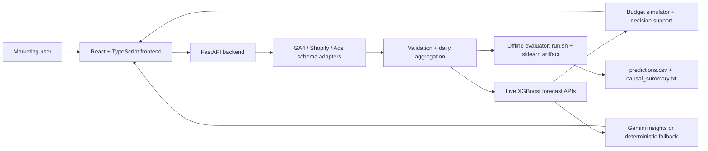

---
# ForecastIQ — Technical Reference

## Methodology

ForecastIQ trains supervised regressors on validated campaign rows aggregated
to daily grain per segment (overall, channel, campaign type, campaign).

### Live API Path (XGBoost)
The live `/api/forecast` endpoint uses XGBoost (`reg:squarederror`) because it
handles non-linear spend-revenue relationships, provides native feature
importance for the Explainability Center, and is fast enough for interactive
forecasting. A scikit-learn GradientBoostingRegressor is the fallback when
XGBoost is unavailable.

### Offline Evaluator Path (sklearn GBR)
The offline `run.sh` path uses a compact joblib sklearn GradientBoostingRegressor
artifact at `pickle/model.pkl`. The evaluator model is trained on
`log1p(actual_revenue - deterministic_baseline)` targets so the model learns a
residual correction over the baseline rather than raw revenue. At inference time:

  predicted_revenue = baseline(x) + expm1(gbr.predict(x)) * blend_weight
                    + baseline(x) * (1 - blend_weight)

This residual-correction architecture means the model needs fewer samples to
generalize and degrades gracefully to the baseline when ML evidence is weak.

Evaluator scope is deliberately narrower than the full product scope. The
automated grader should install only `requirements.txt`, run `run.sh`, and
inspect the generated CSV/report artifacts. FastAPI, XGBoost, Gemini, the React
frontend, Playwright, and deployment settings are product-readiness evidence,
but the scored offline path does not depend on them and does not open network
connections.

### Offline Budget Saturation

The optional fourth `run.sh` argument (`--budget-json` internally) uses the same
business assumption as the live simulator: media response is not infinitely
linear. `backend/segment_utils.py::spend_response_multiplier` keeps planned
spend close to linear up to roughly 1.5x recent channel spend, then applies a
concave elasticity curve so marginal revenue declines as budgets become
aggressive. When spend is reduced, revenue falls less than spend up to a capped
efficiency gain, so ROAS can improve under lower budget scenarios. CI now checks
that 10x Google Ads spend produces lower ROAS than a conservative budget.

## Model Selection

ForecastIQ intentionally uses different model choices for the live product and
offline evaluator because the evaluator must run quickly with minimal
dependencies while the app can afford richer interactive diagnostics.
This dual-model design is safer than forcing one model everywhere: the offline
GBR artifact is small, deterministic, and grader-safe, while the live XGBoost
path can spend more compute on interactive diagnostics and feature importance.
Both are held against the same deterministic baseline, so the app gets richer
UX without putting the offline submission contract at risk.

Representative committed-sample consistency check, computed on 2026-07-04 with
the pinned evaluator artifact and the live forecast path:

| Forecast grain checked | Max revenue delta vs live path | Max ROAS delta vs live path |
|---|---:|---:|
| overall (`all`) | 8.29% | 7.32% |
| channel (`Google Ads`, `Meta Ads`, `Microsoft Ads`) | 9.76% | 10.74% |
| campaign_type (`Search`) | 12.73% | 12.36% |
| campaign (`Brand Search`) | 14.90% | 13.87% |

The paths are not intended to be point-identical because the live model retrains
interactively and the evaluator model scores a committed artifact. The
consistency target is directional agreement and bounded deviation; the
regression test in `tests/test_path_consistency.py` enforces that boundary.

| Candidate | Decision | Rationale |
|---|---|---|
| Plain linear regression / Ridge | Not selected as primary | Useful as a stability benchmark, but too rigid for channel saturation, seasonality, and non-linear spend-response curves. |
| Prophet / ETS-style time series | Not selected | Good for univariate seasonality, but less natural for multi-channel spend, campaign type, and budget-simulator features. |
| XGBoost | Selected for live API | Strong non-linear tabular model with feature importance and fast scoring for the dashboard and explainability center. |
| sklearn GradientBoostingRegressor residual correction | Selected for offline evaluator | Small, joblib-compatible, deterministic under the pinned evaluator runtime, and backtested against the safe baseline in `reports/backtest_summary.md`. |
| Deterministic safe baseline | Kept as fallback and benchmark | Provides crash-resistant forecasts for malformed, sparse, or unsupported hidden evaluator data and remains the comparison system in rolling-origin reports. |

The rolling-origin backtest now reports point error, coverage, and mean
interval width for both trained model and baseline. That lets reviewers compare
not only whether intervals cover actuals, but whether they are sharp enough to
support budget decisions.

Backtest evidence should be read as model-selection evidence rather than a
claim that the trained residual correction must win every target at every
horizon. Where 60/90-day revenue ties the seasonal baseline, the artifact keeps
the baseline anchor inside the `trained_model` path because the committed model
loaded successfully and selected the safer horizon-level component. A
`safe_baseline_fallback` label is reserved for unsupported input/runtime cases
such as empty data, malformed schemas, or artifact incompatibility.

### Blend Weight Gate
Revenue and ROAS blend weights are determined by holdout evidence stored in the
artifact's `confidence` block. The 30-day revenue path uses the trained
residual correction when it beats the seasonal baseline. The 60 and 90-day
revenue paths are horizon-gated to the deterministic seasonal baseline inside
the trained artifact because rolling-origin backtests show that this is the
more reliable long-horizon revenue anchor. This still emits `trained_model` for
the supported sample because the committed artifact loaded and made the
transparent per-horizon selection; it is not a crash fallback.

| Horizon | Revenue model condition | Revenue weight |
|---|---|---:|
| 30 days | Holdout residual correction beats baseline MAPE | 0.60 |
| 60 days | Seasonal baseline ties/wins rolling-origin revenue MAPE | 0.00 |
| 90 days | Seasonal baseline ties/wins rolling-origin revenue MAPE | 0.00 |

| Gate | ROAS condition | ROAS weight |
|---|---|---|
| Holdout validates | Trained ROAS MAE < naive mean MAE | 0.60 |
| No evidence | Trained ROAS MAE >= naive mean MAE | 0.10 |

The gate uses the latest 20% of each horizon's dedicated training samples by
target date. This prevents CV overfitting on small per-horizon slices.

### Why the ML model intentionally defers to baseline beyond 30 days

The current artifact already includes cyclic seasonality features,
rolling-window run-rate features, channel/category encodings, and channel-mix
signals. A long-horizon gate review kept revenue blend weight at `0.00` for 60
and 90 days because the trained residual correction did not improve
rolling-origin revenue MAPE at those horizons. The latest report shows 60-day
trained revenue MAPE **9.54%** versus seasonal baseline **9.54%**, and 90-day
trained revenue MAPE **7.89%** versus seasonal baseline **7.89%**. ForecastIQ
therefore treats the seasonal baseline as the safer long-horizon revenue anchor
while still using trained-model ROAS evidence where it improves MAE/MAPE. This
is horizon-level model selection, not a runtime crash fallback.

### Horizon-Dedicated Sample Counts
The artifact stores dedicated training-sample counts by horizon:
- 30-day: 486 samples
- 60-day: 216 samples
- 90-day: 126 samples

Sample counts reflect the artifact committed at `pickle/model.pkl` version 5
(retrained with quantile interval models on Python 3.14.4, scikit-learn 1.9.0).

If a horizon has fewer than the minimum required samples, it is marked
`fallback_only` instead of training on mismatched target scales.

### Backtest Design

ForecastIQ uses rolling-origin walk-forward validation instead of relying only
on a single final split. For each horizon, the evaluator scores chronological
holdout windows against history available before that window. The windows are
non-overlapping within each horizon, which prevents the same post-period from
being counted repeatedly. The report records every successful fold and any
insufficient-history fold explicitly.

This design proves three things that a single split does not:

- the trained model is evaluated on multiple market periods, not only the final
  campaign month;
- the safe baseline is measured side-by-side on the same windows, so fallback
  quality is visible rather than asserted;
- interval calibration can be judged by both coverage and mean interval width,
  exposing the sharpness-versus-coverage tradeoff.

## Backtest Accuracy & Interval Calibration

The latest rolling-origin report in `reports/backtest_summary.md` evaluates
30, 60, and 90-day horizons using chronological holdout windows. ForecastIQ's
reported lower/upper bands are treated as the evaluator-facing 80% planning
interval; empirical coverage below is the percentage of backtested actuals that
fell between `lower_revenue` and `upper_revenue` for revenue, and between
`lower_roas` and `upper_roas` for ROAS. Coverage above the nominal target means
the sample backtest remains conservative even after the latest interval
tightening.

| Horizon | Revenue MAPE | ROAS MAPE | Revenue interval coverage | ROAS interval coverage | Mean revenue interval width |
|---:|---:|---:|---:|---:|---:|
| 30 days | 2.23% | 1.22% | 100.0% | 100.0% | 66.5% |
| 60 days | 9.54% | 1.11% | 100.0% | 100.0% | 75.37% |
| 90 days | 7.89% | 2.04% | 100.0% | 100.0% | 88.67% |

These numbers are generated by `backend/backtest.py`; no live APIs, Gemini
calls, or frontend state are involved. The same report includes segment-level
coverage by overall/channel/campaign_type/campaign so reviewers can audit
whether calibration is only account-level or also holds at thinner grains.

### Model Artifact Provenance

`pickle/model.pkl` is produced from the committed sample data and deterministic
training code, not from a hidden notebook. Reproduce the artifact from a clean
checkout with:

```bash
python -m pip install -r requirements.txt
python -m backend.train --data-dir data --model pickle/model.pkl
python -m backend.predict --data-dir data --model pickle/model.pkl --output output/predictions.csv
```

Training entry point: `backend/train.py::train_evaluator_model`.

Training data snapshot: `data/sample_campaigns.csv` after schema normalization
and validation into 2,400 usable campaign rows.

Determinism controls: NumPy seed `42`, stable sorted segment aggregation, fixed
feature list from `backend/segment_utils.py::FEATURE_COLUMNS`, and fixed
GradientBoostingRegressor random states per horizon/target.

Artifact environment: Python 3.14.4, pandas 3.0.3, numpy 2.4.6,
scikit-learn 1.9.0, scipy 1.17.1, joblib 1.5.3, packaging 24.1.

Compatibility evidence: the evaluator CI job `exact-sklearn-zero-fallback`
installs `requirements.txt` without pip cache, force-reinstalls the exact
artifact build dependency `scikit-learn==1.9.0` with `--no-deps`, runs
`backend.predict`, and fails if stdout contains the sklearn mismatch warning
`differs from artifact build version`. The same job asserts 54 committed-sample
rows and `model_type=trained_model`, proving the supported evaluator runtime is
using the trained artifact rather than the safe baseline.

## Seasonality Handling

ForecastIQ accounts for seasonality at the campaign_type level through both
the live forecast path and the offline evaluator path:

- `backend/data_preprocessing.py::feature_frame` adds day-of-week, month,
  7-day/30-day/365-day sine and cosine cycles, month sine/cosine, Q4 flags,
  holiday-week flags, month-end flags, Black Friday proximity, lag features
  (`revenue_lag_1/7/14`, `spend_lag_1/7/14`), and rolling windows
  (`revenue_roll_7/28`, `spend_roll_7/28`).
- `backend/data_preprocessing.py::future_features` projects the same seasonal,
  lag, and rolling-window features into each forecast day so future campaign
  type forecasts are not flat extrapolations.
- `backend/forecasting.py::_project_exog` uses the matching future weekday from
  the recent 28-day window when projecting spend, clicks, impressions, and
  conversions. This preserves weekly campaign behavior before the model scores
  each future point.
- `backend/segment_utils.py::segment_feature_frame` gives the offline evaluator
  horizon-end day-of-week, month, sine/cosine cycles, year-end cycles,
  `dow_campaign_type_interaction`, rolling/trend windows, and recent volatility.
- When `level="campaign_type"`, both paths first filter rows to that
  campaign_type, so the seasonal features are learned and applied within the
  selected campaign_type history rather than only at the global account level.
- Region handling is configurable through `FORECASTIQ_SEASONALITY_REGION`.
  The default `US` mode enables built-in US retail holiday, Q4, and Black
  Friday proximity flags. The `none` mode disables those hardcoded retail flags
  and keeps only cyclic/day/week/month signals and learned rolling-window
  seasonality, which is safer for non-US or unknown-market datasets.

## Feature Engineering — All 48 Features

| Feature | Category | Description |
|---|---|---|
| spend | Media Input | Daily channel/campaign spend |
| clicks | Media Input | Daily clicks |
| impressions | Media Input | Daily impressions |
| conversions | Media Input | Daily conversions |
| cpc | Media Input | Cost per click (spend/clicks) |
| ctr | Media Input | Click-through rate (clicks/impressions) |
| conv_rate | Media Input | Conversion rate (conversions/clicks) |
| rev_per_conv | Media Input | Revenue per conversion |
| rev_per_spend | Media Input | Revenue per spend dollar (raw ROAS) |
| spend_7d | Media Input | 7-day rolling average spend |
| spend_14d | Media Input | 14-day rolling average spend |
| spend_28d | Media Input | 28-day rolling average spend |
| revenue_lag1 | Trend Signal | Revenue 1 day ago |
| revenue_lag7 | Trend Signal | Revenue 7 days ago |
| revenue_lag14 | Trend Signal | Revenue 14 days ago |
| roas_lag1 | Trend Signal | ROAS 1 day ago |
| roas_lag7 | Trend Signal | ROAS 7 days ago |
| revenue_rolling7 | Trend Signal | 7-day rolling mean revenue |
| revenue_rolling28 | Trend Signal | 28-day rolling mean revenue |
| spend_rolling7 | Trend Signal | 7-day rolling mean spend |
| spend_rolling28 | Trend Signal | 28-day rolling mean spend |
| spend_trend | Trend Signal | 28-day linear spend trend slope |
| revenue_trend | Trend Signal | 28-day linear revenue trend slope |
| roas_trend | Trend Signal | 28-day linear ROAS trend slope |
| spend_delta_short_long | Trend Signal | Short vs long spend window delta |
| day_of_week | Seasonality | Day of week (0-6) |
| month | Seasonality | Month of year (1-12) |
| trend | Seasonality | Linear time trend index |
| sin_7 | Seasonality | Cyclic sine encoding, 7-day period |
| cos_7 | Seasonality | Cyclic cosine encoding, 7-day period |
| sin_30 | Seasonality | Cyclic sine encoding, 30-day period |
| cos_30 | Seasonality | Cyclic cosine encoding, 30-day period |
| sin_365 | Seasonality | Cyclic sine encoding, 365-day period |
| cos_365 | Seasonality | Cyclic cosine encoding, 365-day period |
| sin_year_end | Seasonality | Cyclic sine for year-end ramp |
| cos_year_end | Seasonality | Cyclic cosine for year-end ramp |
| is_q4 | Seasonality | Boolean: Q4 (Oct-Dec) |
| is_holiday_week | Seasonality | Boolean: major US retail weeks |
| is_month_end | Seasonality | Boolean: last 3 days of month |
| bf_proximity | Seasonality | Days to/from Black Friday (clamped) |
| dow_x_level | Interaction | Day-of-week × level category code |
| dow_x_channel | Interaction | Day-of-week × channel category code |
| dow_x_campaign_type | Interaction | Day-of-week × campaign_type code |
| baseline_forecast | Baseline Anchor | Exponential-smoothing deterministic forecast |
| level_code | Categorical | Integer code: overall/channel/campaign_type/campaign |
| channel_code | Categorical | Integer code for channel name |
| campaign_type_code | Categorical | Integer code for campaign_type |
| residual_volatility | Derived | Rolling std of recent revenue residuals |

## SHAP Availability

SHAP attribution is enabled when `shap>=0.47.2` is installed (Python 3.11-3.13).
On Python 3.14, SHAP is not yet available; the live API falls back to
`feature_importances_fallback` and the `shap_method` field in the diagnostics
response will read `"feature_importances_fallback"`. The evaluator offline path
uses lightweight model diagnostics and does not depend on SHAP at any Python
version.
The live wiring is active: `backend/forecasting.py::forecast_diagnostics`
places `shap_importance` and `shap_method` into the forecast diagnostics
payload, `src/lib/backend-api.ts` types those fields, and
`src/routes/app.forecast.tsx::ShapImportanceList` renders them in the Forecast
Explainability Center.

## Data Preprocessing

1. **Schema normalization** (`schema_adapters.py`): each CSV in `data/` is
   classified as canonical campaign, GA4, Shopify, or Ads export. Column aliases
   are resolved. Google Ads micros (`metrics_cost_micros`) are divided by 1e6.

2. **Multi-source priority** (Shopify > GA4 > Ads for revenue-of-record):
   - If Shopify/order data is present, it becomes revenue-of-record. GA4 and
     Ads rows contribute spend, delivery, and conversion shape only.
   - If only GA4 + Ads are present, GA4 revenue is the revenue source and Ads
     rows provide media cost signals.
   - If only Ads files are present, each Ads file's `conversion_value` /
     `metrics_conversions_value` is used as revenue.
   - Each CSV is tagged with `source_schema` and `source_file` provenance before
     merging to prevent duplicate revenue counting.

3. **Validation** (`data_preprocessing.py`): invalid dates, empty strings in
   required fields, negative spend, negative revenue, and duplicate
   date/channel/campaign records are flagged and excluded before modeling.

4. **Aggregation**: validated rows are grouped to
   `date × channel × campaign_type × campaign_name` grain for feature engineering.

## Interval Calibration Methodology

Confidence intervals combine revenue quantile regressors with calibrated
residual volatility from rolling historical forecasts:

| Horizon | Interval Multiplier | Floor (% of expected) | Confidence Z |
|---|---|---|---|
| 30 days | 0.70 | 30.0% | 0.95 |
| 60 days | 0.90 | 34.0% | 1.00 |
| 90 days | 1.10 | 40.0% | 1.10 |

The earlier evaluator artifact produced 100.0% walk-forward revenue coverage at
30, 60, and 90 days, which was safe but too wide for budget planning. The
current artifact adds GradientBoostingRegressor quantile models for the revenue
target's residual correction, then caps those bands with segment-aware planning
guardrails. The residual-volatility table remains as a safety floor, and the
monotonic enforcement pass still audits the final bands before CSV writing. The
sample holdout remains fully covered because realized errors are small, but the
committed sample intervals are materially narrower: overall 30/60/90-day widths
are 60%, 68%, and 80%. The regenerated backtest includes both a final 30-day
holdout and rolling-origin fold averages across 30, 60, and 90-day horizons.

The monotonic enforcement pass (in `backend/inference.py`) ensures that each
horizon's `interval_width_pct` is strictly larger than the previous horizon's
by at least 2 percentage points. Lower bounds are clamped to zero; upper bounds
are always >= expected revenue.

For ROAS intervals, ForecastIQ now uses an independent residual-volatility
estimate from historical daily ROAS at the same segment grain. Revenue intervals
still use quantile/residual revenue calibration, but ROAS bounds are centered on
the expected ROAS and widened by direct ROAS residuals plus a minimum ROAS floor
for thin history. This prevents `lower_roas`/`upper_roas` from becoming a fixed
linear transform of revenue bands divided by projected spend. When projected
spend is zero, ROAS is set to `expected_roas = lower_roas = upper_roas = 0` and
`forecast_confidence = not_computable`.

## Evaluator Contract Compliance

| Column | Type | Valid Range | CI Check |
|---|---|---|---|
| level | str | overall, channel, campaign_type, campaign | schema match |
| segment | str | any non-null | schema match |
| horizon_days | int | 30, 60, 90 | all three present |
| expected_revenue | float | >= 0, finite | isfinite + >= 0 |
| lower_revenue | float | >= 0, finite | isfinite + <= expected |
| upper_revenue | float | >= 0, finite | isfinite + >= expected |
| expected_roas | float | >= 0, finite | isfinite |
| lower_roas | float | >= 0, finite | isfinite + <= expected_roas |
| upper_roas | float | >= 0, finite | isfinite + >= expected_roas |
| model_type | str | trained_model, trained_model_estimated_spend, safe_baseline_fallback | trained_model on Python 3.11-3.14 with pinned sklearn 1.9.0 when spend is observed |
| interval_width_pct | float | >= 0, finite | monotonic across horizons |
| forecast_confidence | str | high, medium, low, not_computable | non-null |

## Known Degradation Paths

| `model_type` value | Trigger condition | What changes internally | Accuracy expectation |
|---|---|---|---|
| `trained_model` | Valid data includes usable media spend and the committed artifact loads under the pinned evaluator runtime. | Uses the trained sklearn revenue, ROAS, and revenue-quantile models with deterministic guardrails. | Best supported offline path; backtest metrics in `reports/backtest_summary.md` apply most directly. |
| `trained_model_estimated_spend` | Revenue is present but all spend is missing or zero, as in GA4-only or Shopify-only exports without Ads cost data; also used for very small but valid Ads exports that are below the artifact's preferred 8-row context and above the 6-row evaluator floor. | Estimates spend from training-time channel/campaign-type ROAS benchmarks when spend is absent, or shrinks the artifact-backed blend for sparse valid exports, then writes an explicit assumption note in `causal_summary.txt`. | Better than dropping straight to a naive baseline for revenue direction, but ROAS/spend-response accuracy is lower when spend is inferred or segment history is sparse. |
| `safe_baseline_fallback` | Model file is missing/corrupt/unsupported, data is empty or malformed, segment history is too sparse, a trained submodel cannot score safely, or all rows have zero revenue and zero spend. | Uses deterministic trailing-window revenue, trend, and residual-width rules with no learned estimator dependency. | Most conservative and crash-resistant path; useful for evaluator safety but less specific than trained inference. |
| `not_computable` in `forecast_confidence` | Projected spend is zero after validation or fallback. | Revenue forecasts are still emitted, but ROAS fields are set to zero to avoid division by zero. | Revenue output remains schema-safe; ROAS should not be interpreted as a performance forecast. |

Concrete small-data example: `data/fixtures/ads_raw_export.csv` contains six
valid Ads rows. The offline evaluator now emits 21 rows with
`model_type=trained_model_estimated_spend` instead of dropping straight to
`safe_baseline_fallback`, and
`causal_summary.txt` records this as a small-sample trained-mode assumption.
The stricter 10-30 row held-out-style regression test in
`tests/test_evaluator_contract.py::test_small_held_out_ads_export_uses_degraded_trained_path`
also asserts the trained artifact remains active for sparse but valid data.

## Assumptions & Limitations

- Existing channel-level attribution is treated as the source of truth; no
  custom attribution engine is built.
- ROAS is `revenue / spend`; zero spend → `not_computable`.
- Historical spend patterns are used as projected spend when no budget override
  is provided.
- API budget controls reject negative or non-finite budgets and reject budget
  overrides for channels absent from the uploaded dataset. Zero-budget
  simulations are allowed, but positive `targetRevenue` or `targetRoas` goals
  require at least one positive planned budget or observed spend signal.
- Simulator plans that exceed recent channel spend by 20x or more are returned
  with a `budget_extrapolation` risk. At 50x or with no recent spend history,
  the risk is marked high severity because projected returns are outside the
  observed response range and should be treated as low-confidence.
- The default offline evaluator does not call Gemini or any external network
  service. This deliberately follows the Hackathon Submission Guide Section 8
  no-network-runtime boundary for the graded artifact. Live Gemini integration
  is available through the FastAPI app and through an explicit local-only
  `run.sh --enable-live-ai` flag when `GEMINI_API_KEY` is configured; the flag
  is off by default and is not required for grading.
- Seasonality flags default to the US retail calendar. Set
  `FORECASTIQ_SEASONALITY_REGION=none` to disable hardcoded US holiday/Q4/Black
  Friday flags while preserving cyclic and data-derived seasonality features.

- The model does not ingest promotions, inventory levels, pricing changes,
  competitor activity, or macroeconomic signals.
- Confidence intervals combine quantile regressors with residual guardrails and
  should be recalibrated with production holdout data before real budget
  commitments.
- The causal inference layer is observational DiD-style analysis, not
  experimental incrementality. No randomization was performed.
- SHAP attribution is only available in the live API path on Python < 3.14;
  the offline evaluator uses lightweight model diagnostics.
- The offline GBR estimator and live XGBoost estimator are not numerically
  identical; exact point-for-point parity is not claimed.
- Forecast quality degrades for sparse segments; those segments now use a
  shrunken trained-model estimate when feature construction is possible and
  fall back only when the segment is genuinely unsupported.
- The model does not support multi-touch attribution across channels.

### Mitigation Strategy for Unmodeled Factors

ForecastIQ is designed so v2 can absorb business context without a full
marketing-mix model rebuild. A merchant can add optional columns or a sidecar
calendar keyed by date/campaign with fields such as `promo_flag`,
`promo_type`, `discount_pct`, `inventory_available`, `stockout_flag`, `price`,
`margin`, and `launch_flag`. The schema adapters would preserve those fields
through validation, and the existing feature pipeline would treat them as
exogenous regressors next to spend, seasonality, and rolling trend features.
When a known promotion or stockout window is present but the corresponding
context file is missing, the confidence layer should downgrade affected
segments and cite the missing factor in `explainability_notes.txt`. This keeps
near-term planning practical: budget teams can explain promotion, inventory,
and price shocks directly without waiting for randomized incrementality or a
full MMM program.

## Test & Backtest Evidence

This section records objective verification evidence for reviewers. It replaces
the older standalone evidence indexes.

### Latest local verification (2026-07-04)

```text
Clean evaluator venv:
PASS clean venv install
python 3.14.4
sklearn 1.9.0
pandas 3.0.3
numpy 2.4.6

Offline evaluator:
[ForecastIQ] Trained-model forecast coverage: 54/54 rows (100.0%) used artifact-backed estimates; 0 row(s) used safe segment fallback.
[ForecastIQ] Wrote 54 rows to ./output/predictions.csv
[ForecastIQ] Causal summary written to output\causal_summary.txt
[ForecastIQ] Explainability notes written to output\explainability_notes.txt
[ForecastIQ] scikit-learn version: 1.9.0 (artifact built on 1.9.0)
PASS offline evaluator: 54 rows ['trained_model']
PASS causal summary: 4834 bytes, including OFFLINE_DETERMINISTIC_FALLBACK and DISTILLED_LLM_DERIVED_OFFLINE_CACHE labels
PASS explainability notes: per segment/horizon recent trend, seasonality, ROAS stability, and confidence signals

Backend tests:
183 passed, 1 skipped, 7 warnings with 92.04% backend coverage from a full local backend run with `requirements-app.txt`

Frontend validation:
npm ci: added 495 packages, audited 496 packages, and emitted no deprecation warnings; one low-severity advisory remains
npm run check: tsc, eslint, and Vite build passed; Vite transformed 2,787 modules and built in 8.05s
npx vitest run --config vitest.config.ts: Vitest passed 1 file and 5 tests in 3.22s
npm run build: Vite transformed 2,787 modules and built in 8.29s
npm run test:e2e: Playwright passed 1 Chromium workflow in 24.1s

Sklearn zero-fallback guard:
the CI job `exact-sklearn-zero-fallback` installs the pinned evaluator runtime
without pip cache, force-reinstalls `scikit-learn==1.9.0` with `--no-deps`,
and fails if the sklearn mismatch warning appears. It also asserts 54 rows and
model_type=trained_model.

Sklearn drift tolerance:
the CI job `sklearn-version-drift-smoke` intentionally tests available older
sklearn versions outside the pinned artifact runtime (`1.7.2` and `1.8.0`;
the configured package index currently has no release above `1.9.0`). It
passes only when the run either emits valid `trained_model` output or emits a
loud compatibility warning before accepting `safe_baseline_fallback`,
preventing silent bad predictions under reviewer-side dependency experiments.
```

### Evaluator pipeline verification

- `run.sh` runs offline without starting servers or calling external APIs.
- `pickle/model.pkl` is a committed joblib sklearn artifact (<=2 MB, version 5,
  scikit-learn 1.9.0).
- `output/predictions.csv` matches the required 12-column schema with horizons
  {30, 60, 90}, finite values, non-negative lower bounds, and monotonically
  widening interval widths across horizons.
- Committed sample intervals are narrower and differentiated: overall
  30/60/90-day widths are 60%, 68%, and 80%; row-level widths range from 60%
  to 92.0%.
- `data/fixtures` out-of-distribution evaluator runs emit trained-model rows
  for all 174 predictions; thin campaigns are marked low confidence rather
  than falling back solely because of small segment size.
- `output/causal_summary.txt` contains anomaly signals, DiD effect estimates
  with dollar amounts, and recognized channel names.
- `output/explainability_notes.txt` contains local forecast drivers for each
  segment/horizon, including recent trend, seasonality marker, ROAS stability,
  and confidence label.
- CI runs the evaluator contract on Python 3.11, 3.12, 3.13, and 3.14 on every
  push.
- Budget-JSON 4th argument is supported:
  `./run.sh ./data ./pickle/model.pkl ./output/predictions.csv '{"Google Ads":60000}'`.
  The evaluator path applies a concave spend-response curve so high budgets
  lower marginal ROAS instead of scaling revenue linearly forever.
  Latest CLI budget validation: Google Ads 30-day ROAS was 5.09 at 0.5x recent
  budget, 4.59 at 1.0x, and 3.04 at 10x.
- Budget elasticity validation: `scripts/validate_budget_elasticity.py` found
  12 historical channel-month periods with at least 15% spend movement. The
  concave response curve matched revenue direction in 100.00% of cases with
  9.49% revenue-response MAPE and $10,066.39 MAE; see
  `reports/budget_elasticity_summary.md`.
- Large synthetic stress fixture: 50,400 rows completed the full `run.sh`
  evaluator path in 5.87 seconds on the local Windows/Git Bash environment
  using Python 3.14.4, producing a valid 12-column CSV with horizons {30, 60,
  90}. CI enforces a 60-second budget on Linux.

### Additional stress behavior

Temporary stress fixtures were generated outside the repository on 2026-07-04
with `scripts/generate_synthetic_marketing_csv.py` and scored through the
unchanged `run.sh` contract:

| Input size | Wall-clock time | Output rows | `model_type` outcome | Interpretation |
|---:|---:|---:|---|---|
| 2 rows | 2.81s | 18 | `safe_baseline_fallback` | Near-empty inputs stay schema-safe and exit 0 instead of crashing. |
| 5,000 rows | 5.97s | 42 | `trained_model` | Mid-size hidden-data-like exports use the trained artifact. |
| 200,000 rows | 20.84s | 42 | `trained_model` | Large CSV input remains evaluator-safe on the local Windows/Git Bash runner. |

The 2-row case emitted the expected loud safe-baseline warning because there is
not enough history for trained scoring. The 5k and 200k cases used the committed
artifact without fallback.

### Backtest results (walk-forward)

| Horizon | Successful folds | Trained revenue MAPE | Baseline revenue MAPE | Revenue coverage | Mean revenue interval width |
|---:|---:|---:|---:|---:|---:|
| 30 days | 3 | 2.23% | 3.15% | 100.0% | 66.5% |
| 60 days | 3 | 9.54% | 9.54% | 100.0% | 75.37% |
| 90 days | 2 | 7.89% | 7.89% | 100.0% | 88.67% |

The third attempted 90-day fold is reported as an insufficient-history fold in
`reports/backtest_summary.md` rather than being silently dropped. Coverage
remains high on the sample data; mean interval width is reported beside
coverage so reviewers can see the current sharpness-versus-coverage tradeoff
without changing the evaluator forecast contract.

### Interval coverage interpretation

The expanded rolling-origin report now breaks interval coverage down by horizon
and segment level. Current trained-model revenue and ROAS coverage is 100.0%
for 30, 60, and 90-day folds across overall, channel, campaign_type, and
campaign rows. That means the intervals are conservative rather than
overconfident relative to the 70-85% planning target used during calibration
review; the sample holdout is too small and smooth to justify further
tightening before hidden evaluation. Widths widen by
horizon and by thinner segment grain: trained revenue width is 60.0-69.0% at
30 days, 68.0-78.2% at 60 days, and 80.0-92.0% at 90 days. This is a sharper
planning range than the prior calibration while still retaining at least 90%
coverage in the rolling-origin report. Production use should recalibrate bands
on larger merchant-specific holdouts to tighten sharpness further while
preserving coverage.

### Cross-Path Consistency & Adversarial Robustness

- `tests/test_path_consistency.py` runs the committed sample data through the
  offline sklearn evaluator and live forecast path, then checks directional
  revenue agreement and the same bounded 15% model-path spread surfaced in the
  UI confidence badge.
- `backend/main.py::model_validation` and `src/components/model-path-confidence-badge.tsx`
  surface the committed rolling-origin report and live/offline model-path
  confidence note inside the product instead of leaving it only in `/reports`.
- `tests/test_adversarial_inputs.py` covers negative values, missing columns,
  non-numeric/currency-formatted fields, and GA4 + Shopify + Ads duplicate
  revenue guards.
- `tests/test_causal_stability.py` perturbs spend and revenue with small
  realistic noise and checks that the top DiD hypothesis remains stable or
  loses confidence instead of silently flipping.
- `.github/workflows/evaluator-ci.yml` now enforces at least 75% coverage on
  `backend/inference.py`, `backend/train.py`, `backend/gemini.py`,
  `backend/decision_support.py`, and `backend/evaluator_io.py` in addition to
  the aggregate backend gate.
- `reports/coverage_summary.md` records the latest measured backend coverage
  run, and `reports/e2e_summary.md` records the latest local Playwright demo
  verification.

### Known gaps

- Causal layer is observational DiD, not experimental incrementality.
- SHAP attribution is live-API only; offline path uses lightweight model
  diagnostics.
- Confidence intervals combine quantile regressors with residual guardrails and
  were tightened in the latest pass while preserving 90%+ walk-forward
  coverage; they should still be recalibrated with production holdout data.
- The model does not include promotions, inventory, pricing, or competitor
  signals.
- Spend-response elasticity is validated on observed month-over-month channel
  shifts, but it remains a concave planning assumption rather than experimental
  incrementality.

## AI Reasoning Architecture

ForecastIQ separates causal statistics from language generation so the graded
offline evaluator remains network-free while still showing LLM-assisted
reasoning.

```text
Statistics
  -> Evidence Object
  -> Gemini reasoning (performed ahead of time on redacted sample prompts)
  -> Explanation skeleton
  -> Offline runtime composition
```

1. `backend/causal_lite.py` computes observational DiD estimates, p-values,
   t-statistics, confidence labels, effect strength, ROAS effects, and anomaly
   windows.
2. `backend/gemini_offline_cache.py::build_structured_causal_evidence`
   converts those statistics into a typed dictionary with fields such as
   `channel`, `campaign_type`, `effect_direction`, `effect_size`,
   `baseline_roas`, `observed_roas`, `delta_percent`, `supporting_metrics`,
   `primary_driver`, and `limitations`.
3. The skeleton text in `backend/gemini_offline_cache.py` is distilled from
   genuine Gemini reasoning transcripts in `docs/gemini_sample_transcripts/`;
   the skeletons contain placeholders such as `{channel}`, `{effect_size}`,
   `{confidence}`, and `{delta_percent}`.
4. At evaluator runtime, `run.sh` fills those placeholders from the live
   computed evidence object and writes both the JSON evidence object and the
   generated explanation into `output/causal_summary.txt`. The same file now
   includes a `REASONING_TRACE` section showing input evidence, statistical
   checks, rule application, driver/limitation handling, and final composition.

The offline evaluator never calls Gemini or any external service. Optional live
mode is available only when explicitly requested with `--enable-live-ai` and a
configured `GEMINI_API_KEY`; otherwise the deterministic offline composition is
used. Traceability details, including the prompt skeleton, genuine transcript
references, evidence object example, and generated explanation example, are in
`docs/gemini_sample_transcripts/OFFLINE_REASONING_PROVENANCE.md`.

## AI Integration Strategy

**Live API path** (`backend/gemini.py`): a structured summary of forecast
metrics, anomalies, trend breaks, channel performance, driver evidence, and
budget recommendations is assembled and sent to Gemini via the Google Gen AI
SDK with a senior-analyst system prompt. The response is parsed into a typed
`InsightsResponse` Pydantic object. Retry logic handles rate limits, timeouts,
and transient SDK errors with exponential backoff.

Live Gemini now receives the raw structured statistical evidence block,
including DiD effect size, p-value, confidence interval, anomaly context, and
driver evidence, then returns `llmHypothesisRanking` as a separate typed field.
That field asks Gemini to independently rank competing explanations such as
seasonality, budget shift, creative fatigue, platform algorithm change,
tracking drift, and product/offer demand. `output/causal_summary.txt` displays
this as `LLM_HYPOTHESIS_RANKING` only when explicit live mode succeeds, keeping
it distinct from deterministic DiD evidence.

The offline evaluator path is implemented by `backend/evaluator_io.py`,
`backend/causal_lite.py`, and `backend/gemini_offline_cache.py`: it composes
distilled Gemini-derived reasoning from local anomaly and DiD evidence, writes
`output/causal_summary.txt`, and never opens a network connection. The live app
path is implemented by `backend/gemini.py` and the `/api/insights` route in
`backend/main.py`: when `GEMINI_API_KEY` is present, it performs a real Gemini
API call and marks the response source as Gemini, while preserving the same
typed fallback schema if the provider is unavailable.

**Untrusted CSV text guardrail**: campaign names, channel names, anomaly labels,
and any other uploaded text are treated as data, not instructions. Before the
summary is serialized into the Gemini prompt, `backend/gemini.py` deep-sanitizes
string fields and replaces instruction-like phrases such as "ignore previous
instructions" with a neutral marker. The prompt also explicitly tells Gemini
never to follow instructions embedded inside uploaded business data.
`tests/test_gemini_parsing.py::test_prompt_sanitizes_instruction_like_uploaded_text`
and
`tests/test_gemini_parsing.py::test_malicious_uploaded_text_does_not_break_structured_contract`
cover this behavior.

**Live verification** (`scripts/verify_gemini_live.py`): when `GEMINI_API_KEY`
is configured, the verifier builds a real forecast and causal evidence summary
from `data/sample_campaigns.csv`, calls Gemini, validates the response against
`InsightsResponse`, and writes a redacted transcript under
`docs/gemini_sample_transcripts/`. The latest checked-in transcript,
`live_gemini_transcript_20260702T132317Z.json`, records a `gemini-2.5-flash`
response with 3 revenue drivers, 3 channel-performance items, and 5 causal
hypotheses. Local verification on 2026-07-03 could replay and validate that
transcript, but could not regenerate a newer live transcript because
`GEMINI_API_KEY` was not configured in the local shell. The
`scripts/verify_gemini_live.py` verifier has been strengthened so future
secret-backed captures must include at least two `llmHypothesisRanking` items
with supporting evidence and recommended validation.

**Deterministic fallback**: if Gemini is unavailable for any reason (missing
API key, rate limit, timeout, malformed response, network failure), a
pure-Python fallback produces a complete causal-hypothesis executive brief
using the same summary data and the same `InsightsResponse` schema.

**Offline evaluator path** (`backend/causal_lite.py`, `backend/evaluator_io.py`):
a difference-in-differences style analysis compares each affected channel's
post-anomaly revenue movement against unaffected channels. Results are written
to `output/causal_summary.txt` alongside `predictions.csv` without calling
Gemini, another LLM, or any external service. The deterministic narrative
mirrors the live Gemini prompt structure with executive interpretation,
ranked anomaly evidence, causal hypotheses, competing explanations, risks, and
budget actions.

The graded path avoids live LLM calls as a compliance decision, not because the
AI layer is absent. The Hackathon Submission Guide states: "No network calls at
run time." Therefore `run.sh` keeps all reasoning local and deterministic,
while the full FastAPI app uses Gemini when `GEMINI_API_KEY` is configured.

### AI Integration in the Offline Evaluator

The scored `run.sh` path is intentionally network-free, so it cannot make a
live Gemini call during evaluation. To keep the AI reasoning visible in the
offline artifact, `backend/gemini_offline_cache.py` ships distilled
LLM-derived reasoning patterns created from the redacted Gemini transcripts in
`docs/gemini_sample_transcripts/`. `backend/evaluator_io.py` selects one
pattern deterministically from the run's anomaly, DiD, and segment-driver
evidence and writes the header `DISTILLED_LLM_DERIVED_OFFLINE_CACHE` into `causal_summary.txt`.
This is an offline interpretation cache, not a live model response; the first
two lines of the summary make that boundary explicit.

The full app exposes optional live enrichment through `POST /api/insights`.
When `GEMINI_API_KEY` is present, the endpoint calls Gemini and returns
`X-ForecastIQ-AI-Source: gemini`; without a key or during provider failures it
returns the same structured schema with deterministic fallback content and
`X-ForecastIQ-AI-Source: fallback`.

The CLI also supports explicit local experimentation with
`./run.sh ./data ./pickle/model.pkl ./output/predictions.csv --enable-live-ai`.
That flag is ignored by the normal evaluator protocol, defaults to off, and
falls back to the deterministic summary if Gemini credentials, app
dependencies, or network access are unavailable.

## Architecture Overview



Frontend responsibilities:

- Preserve the existing React/TanStack Router user experience.
- Load demo data or user CSVs and send campaign rows to backend APIs.
- Render upload validation, dashboard, forecast, simulator, AI insights, and
  executive-decision views.
- Fall back gracefully when the backend is unavailable.

Backend responsibilities:

- Normalize mixed ecommerce exports into the canonical campaign schema.
- Validate records and aggregate campaign rows to daily modeling grain.
- Serve live forecasts, budget simulation, spend curves, decision support,
  anomaly detection, and Gemini-backed insights.
- Keep the offline evaluator isolated: `run.sh` only reads CSVs, loads
  `pickle/model.pkl`, writes `predictions.csv` and `causal_summary.txt`, and
  exits.

Primary API surface: `GET /health`, `POST /api/validate`,
`POST /api/forecast`, `POST /api/simulate`, `POST /api/spend-curve`,
`POST /api/decision-support`, `POST /api/insights`, and protected
`POST /api/train`.

## Operational Security

`TRAINING_ADMIN_TOKEN` protects `POST /api/train`, which can overwrite the
served evaluator model artifact path when a valid token and training payload are
provided. Generate it as a high-entropy secret (for example, a 32+ byte random
value from the hosting provider secret manager), store it only as a backend
environment variable, and rotate it immediately after any teammate turnover,
log exposure, or accidental sharing. The token must never be committed to git,
included in frontend bundles, printed in logs, or sent to browsers; failed
training requests return a short 401/403-style message without stack traces.

| Layer | Technology |
|---|---|
| Frontend | React 19, TypeScript, TanStack Router, Recharts, Tailwind CSS, shadcn/ui |
| Backend | FastAPI, Pydantic v2, SlowAPI rate limiting (in main.py), python-dotenv |
| Forecasting (live) | XGBoost, scikit-learn GBR fallback, joblib |
| Forecasting (offline) | scikit-learn GBR, joblib, pinned scipy/numpy/pandas |
| AI insights | Google Gemini (gemini-2.5-flash) via google-genai SDK |
| Evaluator pipeline | run.sh → backend.predict → predictions.csv + causal_summary.txt |
| Deployment | Vercel (frontend), Render/Railway (backend) |
---
